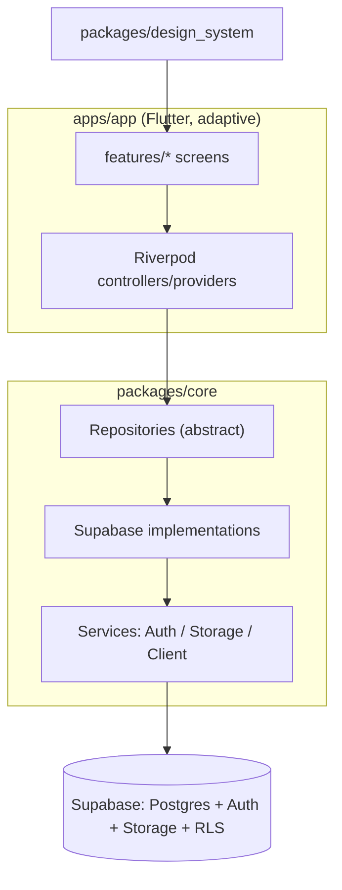
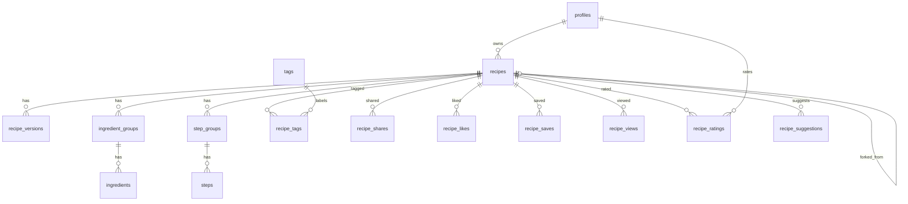

# SDS — Software Design Spec — Secret-Sauce

Authoritative design reference. Kept in sync with the code.

## 1. Overview

Secret-Sauce is a cross-platform recipe vault. Users create richly structured recipes, keep them
private or public, share privately with specific users, and **fork** others' recipes (git-style)
with a **version history** so recipes and their improvements are preserved across generations.

### Goals

- Make recipe **structure and instructions** clear and easy to follow.
- Preserve legacy recipes (attribution + story, immutable version snapshots).
- Enable sharing, discovery, and safe forking/improvement.

### Non-goals (now)

- Upstream "suggest changes" (PR-like) flow — schema hook reserved, UI deferred.
- Real-time collaborative editing.

## 2. Architecture

Single **adaptive** Flutter app; shared logic/UI in packages.



- UI → Riverpod → Repository (abstract) → Supabase impl → Supabase.
- UI never calls Supabase directly.
- Authorization is enforced by **RLS**; client checks are UX-only.

### Layers

| Layer         | Location                     | Responsibility                         |
| ------------- | ---------------------------- | -------------------------------------- |
| Presentation  | `apps/app/features/*`        | Screens, adaptive layout               |
| Design system | `packages/design_system`     | Theme, reusable widgets (`RecipeCard`) |
| State         | `apps/app` (Riverpod)        | Controllers, view-models               |
| Domain/Data   | `packages/core/repositories` | Contracts + Supabase impls             |
| Services      | `packages/core/services`     | Client bootstrap, auth, storage        |

## 3. Data model

### 3.1 Enums

- `difficulty`: `easy` \| `medium` \| `hard`
- `recipe_visibility`: `private` \| `public`
- `share_permission`: `view` (reserved: `edit`)
- `suggestion_status`: `open` \| `accepted` \| `rejected` (reserved for future PR flow)
- `chef_tier`: `home_cook` \| `line_cook` \| `sous_chef` \| `head_chef` \| `master_chef`

### 3.2 Tables

**profiles** — 1:1 with `auth.users`
`id (uuid, PK, = auth.uid)`, `display_name`, `avatar_url`, `bio`, `created_at`,
`chef_score (numeric)`, `chef_tier (chef_tier)`, `public_recipe_count (int)`.
Created by the `on_auth_user_created` trigger. Every other table's `user_id` is an FK to
**profiles**, not `auth.users`, so a missing profile row breaks rating/saving/view logging for
that account — `0001_init.sql` therefore backfills profiles from `auth.users` on every apply
(the trigger only fires on insert, so it cannot repair users that predate it; see B015).

The three `chef_*` columns are **denormalized aggregates** over the engagement counters of the
profile's *public* recipes — never written by the client; the `on_recipe_stats_change` trigger
recomputes them from scratch. See §10.

**recipes**
`id`, `owner_id → profiles`, `title`, `description`, `cover_image_url`, `cuisine`,
`category`, `difficulty`, `prep_minutes`, `cook_minutes`, `servings`,
`visibility`, `attribution` (legacy: original creator/story),
`forked_from_recipe_id → recipes` (nullable), `forked_from_version_id → recipe_versions` (nullable),
`current_version_id → recipe_versions` (nullable), `like_count`, `save_count`, `view_count`,
`rating_sum (numeric)`, `rating_count (int)`, `rating_avg (numeric(3,2))`,
`created_at`, `updated_at`.

The three `rating_*` columns are **denormalized aggregates** — never written by the client;
the `recipe_ratings` trigger recomputes them from scratch so they cannot drift.

**recipe_versions** — git-like immutable snapshots
`id`, `recipe_id → recipes`, `version_number (int)`, `parent_version_id → recipe_versions` (nullable),
`author_id → profiles`, `change_summary`, `content_snapshot (jsonb)` (full recipe body at that point),
`created_at`.

**ingredient_groups**: `id`, `recipe_id`, `name` (e.g. "For the sauce"), `sort_order`.
**ingredients**: `id`, `group_id → ingredient_groups`, `quantity (numeric, nullable)`,
`unit`, `name`, `note`, `is_optional (bool)`, `sort_order`.

**step_groups**: `id`, `recipe_id`, `name`, `sort_order`.
**steps**: `id`, `group_id → step_groups`, `step_order (int)`, `text`, `image_url`,
`duration_minutes`, `temperature`, `tip`, `sort_order`.

**Ordering contract.** Groups and their children are stored and presented in **ascending**
`sort_order` (`step_order` for steps), assigned `0..n-1` by `RecipeRepository._persistContent` in
list order. Reads must ask for ascending **explicitly** — postgrest-dart's `.order(column)`
defaults to `ascending: false`, and omitting the flag reversed every recipe's steps and
ingredients (B022). The invariant is load-bearing beyond display: `update()` re-persists the list
it just read, so a reversed read writes a reversed order back, and `recipe_versions.content_snapshot`
inherits whatever order the read produced.

**tags**: `id`, `name (unique)`. **recipe_tags**: `recipe_id`, `tag_id` (PK pair).

**recipe_shares**: `recipe_id`, `shared_with_user_id → profiles`, `permission (share_permission)`,
`created_at` (PK: recipe_id + user).

**recipe_likes** / **recipe_saves**: `user_id`, `recipe_id`, `created_at` (PK pair).
**recipe_views**: `id`, `recipe_id`, `user_id (nullable)`, `viewed_at`. An append-only log — every
visit inserts a row. The `on_view_insert` trigger rolls it into `recipes.view_count`, counting
**distinct signed-in viewers**: a user's second-and-later row for the same recipe is ignored, and
anonymous rows (`user_id is null`) never count at all. The probe is a read-then-write, so it takes
a per-(recipe, user) `pg_advisory_xact_lock` — without it two concurrent first-views from one
account both bump. Deliberately has no unique constraint, so `logView()` stays a plain insert
(PostgREST cannot express `on conflict` inference against a partial index) and the full log
survives for later analytics.

`view_count` is **monotonic and therefore an upper bound**, not an exact distinct count: nothing
decrements it, and `user_id` is `on delete set null` (unlike `recipe_likes`/`recipe_saves`, which
cascade and fire their DELETE branch), so a deleted account's contribution stays and a
re-registered user counts again.

**recipe_ratings**: `user_id`, `recipe_id` (PK pair), `rating (numeric(2,1))`, `created_at`,
`updated_at`. One row per user per recipe — re-rating overwrites. `rating` is constrained to
**0.5 … 5.0 in half-star steps** (`rating * 2 = floor(rating * 2)`). An `after insert/update/delete`
trigger calls `recompute_recipe_rating(recipe_id)`, which rewrites `recipes.rating_sum`,
`rating_count`, and `rating_avg`.

**recipe_suggestions** _(reserved stub — not wired to UI)_
`id`, `recipe_id (target)`, `from_recipe_id (fork source)`, `author_id`, `status (suggestion_status)`,
`summary`, `payload (jsonb)`, `created_at`.

### 3.3 ERD



## 4. Row-Level Security

- **recipes SELECT**: `visibility = 'public'` OR `owner_id = auth.uid()` OR exists row in
  `recipe_shares` for `(recipe_id, auth.uid())`.
- **recipes INSERT/UPDATE/DELETE**: `owner_id = auth.uid()`.
- Child tables (ingredients/steps/versions/…): access derived from parent recipe visibility.
- **recipe_shares**: recipe owner manages; shared user can read own rows.
- **likes/saves**: user manages own rows; counts denormalized on `recipes` via triggers.
- **views**: anyone who can read a recipe may log a view, including anonymous visitors — but only
  as themselves: `views_insert`'s `with check` requires `user_id is null or user_id = auth.uid()`,
  so a view cannot be attributed to another user. Only the recipe owner can read the log.
  Anonymous rows never move `view_count`, because `anon` holds `insert` on the table and counting
  them would make `recipes_trending` inflatable without an account.
- **counter/aggregate triggers** (`on_like_change`, `on_save_change`, `on_view_insert`,
  `on_rating_change`) are
  `security definer`: they write a `recipes` row the acting user does not own, which plain
  invoker rights would let RLS drop silently (see B011). Their helpers (`bump_count`,
  `recompute_recipe_rating`) have EXECUTE revoked from `public` / `anon` / `authenticated`, so
  PostgREST cannot expose them as RPCs.
- **ratings**: readable by anyone who can read the recipe; a user may write only their own row
  (`user_id = auth.uid()`), only for a recipe they can read, and **never for a recipe they own** —
  self-rating is rejected by the `with check` clause, not just hidden in the UI.
- **profiles**: readable by all; writable only by self. The `chef_*` columns are therefore
  world-readable, which is why the chef score counts **public recipes only** — private-recipe
  engagement (reachable through `recipe_shares`) must not leak into a public number.
  `on_recipe_stats_change` is `security definer` for the same reason `on_like_change` is: the
  acting user is the liker/viewer, not the recipe owner, and `profiles_update` is self-only
  (B011). `recompute_chef_stats` has EXECUTE revoked from `public`/`anon`/`authenticated`.
- **grants**: RLS chooses rows, `GRANT` chooses tables — both are required. The schema grants
  `select` on all public tables to `anon` + `authenticated`, DML to `authenticated`, and
  `insert on recipe_views` to `anon`. Without this a fresh Supabase project returns
  `permission denied for table ...` for every request (B013).

## 5. Forking & versioning

- **Edit** → append a `recipe_versions` row (`version_number = max+1`, `parent_version_id` = prior),
  set `recipes.current_version_id`. Snapshots are immutable → full lineage retained.
- **Fork** → deep-copy recipe + its groups/ingredients/steps into a new recipe owned by the forker;
  set `forked_from_recipe_id` and `forked_from_version_id`. Independent thereafter.
- **Attribution** → `recipes.attribution` free-text preserves legacy origin/story; detail screen
  also shows "Forked from {title} by {owner}" when lineage exists.
- **Future PR flow** → `recipe_suggestions` reserved so a fork can later propose changes upstream.

## 6. Discovery & ranking

- **Access**: Discover, search, and public recipe detail are open to anonymous (signed-out)
  visitors — RLS `recipes SELECT` already permits reading `public` recipes without auth. Sign-in
  is only required for creating/editing, My Recipes, Profile, and owner actions (share, fork).
- **Recent**: `ORDER BY created_at DESC` over public recipes.
- **Popular**: ranked by **star rating**, using a Bayesian (weighted) average so a single 5-star
  recipe does not outrank a 4.8 with hundreds of ratings:

  ```text
  score = (rating_sum + m * C) / (rating_count + m)     m = 5, C = site-wide mean rating
  ```

  `m` phantom ratings sit at the site mean `C` (`sum(rating_sum) / sum(rating_count)` over public
  recipes, defaulting to 3.5 when nothing is rated yet); real ratings pull the score away from that
  prior. Ties break on `rating_count`, then `save_count + like_count`, then `created_at`.
- **Trending**: recency-weighted score, e.g.
  `score = (like_count + view_count) / pow(hours_since_created + 2, 1.5)`. Both inputs are
  one-per-user by construction (`recipe_likes` PK, `on_view_insert` dedup), so the score cannot be
  driven up by repeat traffic from one account or by anonymous visitors.
- **Search**: Postgres full-text over title + description + ingredient names + tags.

## 7. Screens

| Screen         | Route                             | Notes                                                                                 |
| -------------- | --------------------------------- | ------------------------------------------------------------------------------------- |
| Home / landing | `/`                               | Intro, feature highlights, sign in/up                                                 |
| Sign in / up   | `/auth`                           | Supabase auth                                                                         |
| Discover       | `/discover`                       | Popular (rating-ranked) / Trending / Recent tabs + search (public, no sign-in)         |
| Chefs          | `/chefs`                          | Leaderboard ranked by chef score (public, no sign-in)                                 |
| My Recipes     | `/my`                             | Tabs: My / Shared-with-me; `RecipeCard` grid with Public/Private badges                |
| Recipe detail  | `/recipe/:id`                     | Structured view, servings scaler, rating, fork, versions (public recipes viewable signed-out) |
| Recipe editor  | `/recipe/new`, `/recipe/:id/edit` | Structured create/edit                                                                |
| Profile        | `/profile`                        | Current user                                                                          |

### Adaptive behavior

- Narrow (< 600): bottom navigation, single-column lists.
- Wide (≥ 600): fixed top navigation bar, multi-column grids, side-by-side detail.
- Breakpoints centralized in `design_system/layout/adaptive.dart`.

#### Navigation chrome (the one place the platforms diverge)

The bottom bar is mobile, the top bar is web; everything under the chrome is shared. Both read
their destinations from `apps/app/lib/routing/nav_destinations.dart`, and the two lists differ:

| | Destinations | Identity | New recipe |
| --- | --- | --- | --- |
| Compact (< 600), `NavigationBar` | Discover, Chefs, My Recipes, **Profile** | — | extended FAB |
| Web (≥ 600), `TopNavBar` | Discover, Chefs, My Recipes *(signed in only)* | avatar → account menu | on the page (My Recipes header) |

`TopNavBar` (`apps/app/lib/routing/top_nav_bar.dart`) is brand · centred destination pill ·
identity, and nothing else — that is what takes the row from ~700px to ~470px, which is what it
has to fit at 600.

- The pill is centred **on the bar**, not between the clusters: a `CustomMultiChildLayout`
  measures both side clusters and reserves `max(brand, actions)` on each side.
- **Labels never wrap.** The pill measures its labels with a `TextPainter` at the live text scale
  and takes the widest mode that fits — all labels (expanded), active label only (medium, or
  expanded when the measurement says so), icons only with the label as a tooltip. The bar's own
  height scales with the text scaler up to 1.6×.
- Signed out, the actions are `Sign in` + `Sign up` (`/auth?mode=signup`), collapsing to a single
  filled `login` button at medium; My Recipes is not offered, since it could only redirect.
- Signed in, the avatar is the account control: `ChefAvatar` with a `primary` ring and a tier dot,
  fed by `myProfileProvider`, opening a menu of Profile / Sign out. `/profile` is therefore a
  shell route with **no** selected destination — the pill highlights nothing there.

**Two different rules, on purpose.** Navigation chrome switches at the breakpoints
(`responsiveColumns`, `AdaptiveLayout`, `context.isCompact`) — it is a different layout on each
side. The **recipe grid does not**: it flows. `FlowGridMetrics.fit` takes the width actually
available and fits as many columns as can each hold `kRecipeCardMinWidth` (264), caps every tile
at `kRecipeCardMaxWidth` (340), and splits whatever is left over into an equal gutter on each
side so a capped row stays centred. A window drag therefore adds a column at the width where one
genuinely fits, instead of stretching three cards across 1400px and then jumping at 1000.

| Available width | Columns | Card width | Gutter |
| --------------- | ------- | ---------- | ------ |
| 358 (phone)     | 1       | 340 (capped) | 9    |
| 768             | 2       | 340 (capped) | 36   |
| 968             | 3       | 312        | 0      |
| 1408            | 5       | 268.8      | 0      |

The cap belongs to the **grid**, not the card: a grid cell hands its child tight constraints,
which win over any `ConstrainedBox` inside `RecipeCard`, so the only way to hold a tile at 340 is
to hand the delegate less width to divide (that is what the gutter is). `FlowGridMetrics` is pure,
so it is unit-tested directly across a continuous 264→2400 sweep rather than at sampled widths.

## 8. RecipeCard contract

Inputs: cover image, name, short description, cook time (prep+cook), average star rating
(hidden until the recipe has at least one rating), difficulty badge. `showVisibility: true`
adds a public/private chip to the title banner — used on My Recipes, where both kinds are listed.
`showChef` (default true) overlays the owning chef on the cover, bottom-right, whenever
`recipe.owner` is embedded; My Recipes turns it off, since every card there has the same owner.
Used across Discover and My Recipes.

**Anatomy (v2 — the name leads the card).** Top to bottom:

| Band       | Content                                                                                                    | Sizing                          |
| ---------- | ---------------------------------------------------------------------------------------------------------- | ------------------------------- |
| **Banner** | Recipe name on `colorScheme.primary` / `onPrimary`, `titleMedium` w700, **max 2 lines** then ellipsis; the icon-only visibility chip sits at its end | intrinsic                       |
| **Cover**  | Cover image (or the `surfaceContainerHighest` + menu-glyph fallback), chef overlay bottom-right on a scrim   | **flexible — absorbs the slack** |
| **Footer** | Description (2 lines, ellipsized), an `outlineVariant` rule, then the time · rating · difficulty row         | intrinsic                       |

The name is first so it never competes with the photo for the top of the card and stays legible
over a dark or busy cover. A two-line title takes its height **from the cover**, not from the card.

**The card is a fixed-height, bounded-width tile**: `kRecipeCardHeight` (352), passed by
`recipe_grid.dart` as the grid's `mainAxisExtent`, and `kRecipeCardMinWidth` (264) /
`kRecipeCardMaxWidth` (340), which the grid turns into a column count (see §7 *Adaptive
behavior*). It is not a fixed *aspect* — that was the retired card's `childAspectRatio: 0.82`,
which left dead space under every card once the window got wide. `RecipeCard` applies the height
itself, so an unbounded-height parent cannot leave the cover's `Expanded` unbounded (the original
B001 shape); it does **not** apply the width cap, because a grid cell's tight constraints would
override it.

**Both overlays live on the cover `Stack` or in the banner, never in the footer column.** The tile
cannot grow, and all three logged overflow bugs (B001/B002/B016) came from adding an
intrinsically-sized child to a band that had no slack. The cover has slack; the banner and footer
do not — which is also why the visibility chip is **icon-only with the label as a `Tooltip`**: a
"Private" label next to a two-line title is the first thing to overflow at 2.0× text scale.

The banner is drawn in the theme's `titleMedium`. The Claude Design mockup sets it in Newsreader;
shipping that is the app-wide typography decision (`google_fonts` + a `textTheme` in
`app_theme.dart`), not a card-level choice — see ROADMAP Phase 20.

### Rating widgets (`design_system`)

| Widget            | Use                                                                 |
| ----------------- | ------------------------------------------------------------------- |
| `StarRating`      | Read-only 5-star display with half stars, value, and rating count   |
| `RatingPill`      | Compact single star + value, for dense surfaces (`RecipeCard`)      |
| `StarRatingInput` | Interactive half-star input; `onChangeEnd` fires when a gesture ends |

### Chef widgets (`design_system`)

| Widget      | Use                                                                                    |
| ----------- | -------------------------------------------------------------------------------------- |
| `TierChip`  | Tier pill (icon + label); `dense` drops the icon. `colorFor(tier, brightness)` is the shared accent, also used by the leaderboard rank medallion |
| `ChefAvatar` | The circle alone: photo when there is one, `initialsFor(name)` when there is not. Optional `ringColor` (a `surfaceColor` gap then a ring) and `tier` (rank dot, bottom-right) — both used by the web top navigation, where the avatar *is* the account control and has to carry rank at 34px. Ring and dot are drawn **outside** the circle, so a ringed avatar is wider than `radius * 2` |
| `ChefBadge` | `ChefAvatar` + name with the `TierChip` **under** the name; `compact` for dense surfaces, `onSurfaceImage` for the card's cover overlay. `ChefBadge.fromProfile(recipe.owner!)` is the usual call |

Per-tier colors are defined as a light/dark pair — the light shades are unreadable on dark
surfaces and vice versa, so `colorFor` resolves against `Theme.of(context).brightness`.

`StarRatingInput` maps the left half of star _n_ to `n - 0.5` and the right half to `n`, and
previews during a drag; the caller persists on `onChangeEnd` so a drag writes once, not per frame.
If the gesture is **cancelled** — an ancestor scroll view claims it after a press-and-hold — the
preview is dropped and `onChangeEnd` never fires, so the stars never show an unsaved value (B017).

The `RecipeCard` metadata row (time · rating · difficulty) is width-adaptive: the time label and
both `RatingPill` texts are `Flexible` and ellipsize in that order, inside an `Expanded` group.
A fixed-height grid tile cannot grow, so the row degrades instead of overflowing at narrow widths
or large text scale (B016). The `DifficultyBadge` is the row's **only non-flex child** — it takes
its intrinsic width, sits flush right, and is capped at half the row by a `LayoutBuilder` +
`ConstrainedBox`. Giving it a flex instead makes `RenderFlex` reserve half the row for it whatever
its label says (B026); giving it no cap overflows by 1px at 276px / 2.0×.

## 9. Security notes

- No secrets in source; Supabase keys via `--dart-define` / env.
- All authorization via RLS; never rely on client filtering for privacy.
- Storage buckets scoped; signed/public URLs per bucket policy.

## 10. Chefs, tiers & leaderboard

> Status: **implemented (Phase 18).** The schema, columns, and screens described here exist;
> §3, §4, §7, and §8 carry the summary and this section is the detail. Execution detail:
> [EXECUTION-PLAN.md Phase 18](./EXECUTION-PLAN.md#phase-18--chefs-tiers--leaderboard).

### 10.1 Concept

Every user **is** a chef — "chef" is a presentation of `profiles`, not a new table or role. A
chef has a **tier**, derived from a **chef score** computed over the engagement counters
(`like_count`, `save_count`, `view_count`) of the **public** recipes they own. Recipes already
have exactly one chef: `recipes.owner_id → profiles` is non-null, and a fork produces a *new*
recipe owned by the forker (lineage tracked separately via `forked_from_*`) — no schema change
is needed for the "one recipe : one chef" rule; it holds by construction.

### 10.2 Score & tiers (server-owned, tunable in one place)

Postgres enum `chef_tier`, mirrored in `enums.dart` — this makes **five** mirrored enums:

```
chef_tier: home_cook | line_cook | sous_chef | head_chef | master_chef
```

Two immutable SQL functions are the single source of truth — changing the formula or the
thresholds is a one-function edit plus the idempotent backfill that already runs on every apply:

```text
chef_score(likes, saves, views) = 3·likes + 5·saves + 0.2·views      -- over PUBLIC recipes only
chef_tier_for(score):  ≥ 20000 → master_chef
                       ≥  5000 → head_chef
                       ≥  1000 → sous_chef
                       ≥   100 → line_cook
                       else    → home_cook
```

Rationale: a save is the strongest intent signal, a like weaker, a view weakest (and `view_count`
is a deduped, anon-excluded upper bound — see §3.2 / B012 — so it is safe to include at low
weight). Ratings are deliberately **not** in v1 of the formula (the request scopes ranking to
popularity/likes/saves); a Bayesian rating term is the obvious v2 refinement. Thresholds are
inclusive (`>=`) and the seed pins a boundary case to prove it.

**Only public recipes count.** Private-recipe engagement (possible via `recipe_shares`) must not
leak into a world-readable number. Flipping a recipe private drops its contribution on the next
recompute; deleting it likewise.

### 10.3 Storage: denormalized onto `profiles`, recomputed from scratch

Follows the `recipes.rating_*` precedent exactly — denormalized aggregates, recompute-from-scratch
(never incremental), trigger-maintained, **server-owned** (client never writes them):

- `profiles.chef_score numeric not null default 0`
- `profiles.chef_tier chef_tier not null default 'home_cook'`
- `profiles.public_recipe_count int not null default 0`

(added via `alter table … add column if not exists`, per the idempotency rule).

- `recompute_chef_stats(p_chef uuid)` — one set-based UPDATE aggregating that chef's public
  recipes. Invoker-rights, EXECUTE **revoked** from `public`/`anon`/`authenticated` (the
  `bump_count` rule — every `public` function is otherwise a PostgREST RPC).
- Trigger `on_recipe_stats_change` on `recipes`: `after insert or delete or update of like_count,
  save_count, view_count, rating_sum, rating_count, visibility, owner_id`, recomputing
  `new.owner_id` (and `old.owner_id` when it differs, and on delete). **Must be
  `security definer set search_path = public`** — it updates a `profiles` row the acting user
  (liker/viewer) does not own, and `profiles_update` RLS is self-only; invoker rights would
  silently update 0 rows (B011 class). No recursion: it writes `profiles`, never `recipes`.
- Idempotent backfill in `0001_init.sql` (B015 precedent): one set-based UPDATE recomputing all
  profiles on every apply — this is also how a formula/threshold change reaches existing rows.
- `supabase/scripts/drop.sql` gains: the trigger's function, `recompute_chef_stats(uuid)`,
  `chef_score(...)`, `chef_tier_for(numeric)`, `chefs_leaderboard(int, int)`, and
  `drop type if exists chef_tier`.

Why denormalize instead of computing at read time: the chef badge renders on **every recipe
card**, so tier must arrive with the recipe list in one query (PostgREST embedding, §10.5) —
a per-card RPC would be an N+1, and a batched "tiers for these owners" RPC pushes orchestration
into every list provider. Cost: one extra single-row `profiles` write when a recipe's counters
move. Acceptable at this scale.

### 10.4 Leaderboard RPC

```sql
chefs_leaderboard(p_limit int default 50, p_offset int default 0)
  returns table (chef_rank bigint, id uuid, display_name text, avatar_url text,
                 chef_tier chef_tier, chef_score numeric, public_recipe_count int,
                 total_likes bigint, total_saves bigint, total_views bigint)
```

- `stable`, invoker-rights, **callable by `anon`** — the leaderboard page is signed-out safe,
  like Discover. `profiles` is already world-readable; the recipe sums filter
  `visibility = 'public'` **explicitly** (not via RLS) so every viewer sees identical numbers —
  under invoker RLS a signed-in chef would otherwise see their own private recipes folded in.
- `chef_rank` = `dense_rank() over (order by chef_score desc)` — tied scores share a rank.
  Deterministic full ordering: `chef_score desc, public_recipe_count desc, display_name asc,
  id asc`.
- **Excludes chefs with `public_recipe_count = 0`** (tasters, private-only chefs, brand-new
  accounts). They still *have* a tier (`home_cook`) for badge purposes; they just don't occupy
  leaderboard rows.

### 10.5 Client data path

- `Profile` model gains `chefScore`, `chefTier`, `publicRecipeCount` (JSON keys = column names).
  `ChefTier` enum decodes with `unknownEnumValue: ChefTier.homeCook` so an older client survives
  a future tier addition.
- `Recipe` model gains an optional embedded `Profile? owner`, populated by the `kRecipeSelect`
  fragment in `core/src/repositories/recipe_queries.dart`, which is used by `getById`,
  `listMine`, `listSharedWithMe`, and all four Discover queries (PostgREST accepts `.select()`
  embedding on the RPCs too, since they return `setof recipes`). Null-safe: surfaces that don't
  embed simply render no badge.

  **The FK hint is mandatory.** The obvious `owner:profiles(...)` does **not** work — `recipes`
  and `profiles` are related five ways (`owner_id`, plus many-to-many through `recipe_likes`,
  `recipe_ratings`, `recipe_saves`, `recipe_shares`), so PostgREST rejects the ambiguous form
  with `PGRST201: Could not embed because more than one relationship was found`. The working
  fragment is:

  ```text
  *,owner:profiles!recipes_owner_id_fkey(id,display_name,avatar_url,chef_tier)
  ```

  Dropping the hint breaks every recipe query at once, which is why the fragment is a single
  shared constant rather than repeated per call site.
- `ChefRepository` (abstract + `SupabaseChefRepository`, same file, wired in
  `core/src/providers.dart`): `leaderboard({int limit, int offset})` → `List<ChefStanding>`.
  `ChefStanding` is a freezed model mirroring the RPC row. Signed-out safe by construction
  (no `_uid` use). `chef_score` is Postgres `numeric`, so it decodes through
  `(v as num).toDouble()` — a bare `as double` would throw on a whole-number score.

### 10.6 UI

- **`TierChip`** (`design_system`, exported from the barrel): compact pill with tier icon +
  label. Fixed English labels ("Home Cook" … "Master Chef"); per-tier accent colors defined as
  theme-aware tokens (must pass light + dark).
- **`ChefBadge`** (`design_system`, exported): avatar + display name with the `TierChip` **under
  the name** (per the product requirement), plus a `compact` variant and an `onSurfaceImage` flag
  for the cover overlay. Falls back to initials without an avatar, and to "Unnamed chef" on an
  empty display name.
- **`RecipeCard`**: the badge **overlays the cover image, bottom-right** (a `Positioned` in the
  existing `Stack`, diagonally opposite the banner's visibility chip), on a scrim, name ellipsized.
  It must NOT be a new row in the footer column: the card is a fixed-height tile
  (`kRecipeCardHeight`) and three prior overflow bugs (B001/B002/B016) all came from adding
  intrinsic children to a band with no slack.
  Renders only when `recipe.owner != null` and `showChef` is true (My Recipes turns it off —
  every card there has the same owner). Regression tests at the standard envelope: both ends of
  the card's width range (`kRecipeCardMinWidth` 264 and `kRecipeCardMaxWidth` 340), longest tier
  label, 2.0× text scale.
- **Recipe detail**: full-size `ChefBadge` under the title (tap target reserved for a future
  chef-profile page).
- **Leaderboard screen** `features/chefs/` at **`/chefs`**, inside the `ShellRoute`, added to
  `AppShell._destinations` (trophy icon, "Chefs") — signed-out safe, so **no** change to the
  router's `needsAuth` list. Rows: rank medallion, `ChefBadge`, score, recipe/like/save/view
  counts; standard loading/empty/error states; `limit 50` (pagination deferred, though the RPC
  already takes an offset).

  Two layout rules that row learned the hard way (B023): the trailing score column is
  **width-bounded** — an unconstrained `Column` takes its intrinsic width and at 2.0× scale on a
  320 px phone it starved the badge beside it until the badge's own row overflowed — and the stat
  labels are `Flexible`, since a `Wrap` constrains each child to the wrap width and an
  intrinsically-sized `Text` in a `Row` has no way to degrade.

### 10.7 Seed & edge cases

Fixed-UUID chef accounts (`…00d1`–`…00d7`), passwords randomized exactly like the tasters
(B018 — `seed.sql` runs on production by documented procedure). `seed_recipe()` gained a
`p_visibility` parameter defaulting to `'public'` — a **signature change**, so the old 16-argument
signature is in `drop.sql` (Gotcha 5). Actual seeded standings:

| Chef | Name | Likes | Saves | Views | Score | Tier | Pins |
| ---- | ---- | ----- | ----- | ----- | ----- | ---- | ---- |
| d1 | Amara Okonkwo | 4000 | 1600 | 5000 | 21000 | `master_chef` | ≥ 20000, **summed across two recipes** |
| — | Secret Sauce Kitchen | 1228 | 941 | 9000 | 10189 | `head_chef` | lands there unassisted from the curated recipes |
| d2 | Bruno Castellani | 1000 | 400 | 2500 | 5500 | `head_chef` | ≥ 5000 |
| d3 | Chen Wei | 200 | 100 | 500 | 1200 | `sous_chef` | ≥ 1000 |
| d4 | Dara Nilsson | 20 | 8 | 0 | **100** | `line_cook` | exactly the threshold — proves `>=` is inclusive |
| d5 | Elif Yilmaz | 0 | 0 | 0 | 0 | `home_cook` | public recipes, zero engagement — ranked last |
| d6 | Farid Haddad | 5000 | 2000 | 10000 | **0** | `home_cook` | **private-only**: would score 27000 if private counted; absent from the board |
| d7 | Greta Lindqvist | 100 | 180 | 0 | **1200** | `sous_chef` | ties d3 via a different mix — proves `dense_rank` shares a rank |
| — | tasters ×8 | — | — | — | 0 | `home_cook` | no recipes — guard for the `public_recipe_count > 0` filter |

> **Since Phase 19, only the `d1`–`d7` rows come from `seed.sql`.** The Kitchen's recipes moved to
> `recipeData/` → `seed_recipes.sql`, taking their engagement counters and ratings with them as
> `demo` blocks. The 10189 / `head_chef` standing is unchanged and now comes from that file;
> `public_recipe_count` is 15, because the nine newly authored recipes carry no engagement and
> contribute 0 to the score. Verified after the move — see §11.

### 10.8 Known limits (accepted for v1)

- **Self-engagement counts.** Unlike ratings (RLS-blocked), a chef may like/save their own
  recipes, and sock-puppet accounts can inflate any input. `view_count` is already
  anon-proof/dedup'd (B012); likes and saves are one-per-account but account creation is free.
  Score is not money — deferred, noted here so it isn't rediscovered as a "bug".
- Tier thresholds are provisional product numbers; expect retuning once real data exists (the
  backfill-on-apply makes retuning a one-line change).
- No chef-profile page yet; the badge is not tappable-to-navigate in v1.
- Rank is recomputed per request (no caching); fine at current scale.

## 11. Recipe content vs. demo data

Two seed files, split because they have different lifespans.

| | `supabase/seed.sql` | `supabase/seed_recipes.sql` |
| --- | --- | --- |
| What | Demo fixtures: the Kitchen + taster + chef **accounts**, the `d1`–`d7` demo recipes, and the rating machinery | All 14 of the Secret Sauce Kitchen's recipes |
| Authored in | the file itself | `recipeData/recipes/<slug>.json` |
| Generated | no | **yes** — `tool/recipes.dart`, committed |
| Lifespan | deleted once there is real traffic | permanent |
| Helper | `seed_recipe` (flat, one unnamed group) | `seed_recipe_v2` (group-aware) |

The Kitchen's six original recipes used to live in `seed.sql` as well; Phase 19 moved them out, so
each recipe now has exactly one definition. Their engagement counters and taster ratings came with
them as a `demo` block per recipe, and the resulting `chef_score` is byte-identical (10189,
`head_chef`).

Both files bootstrap the same Kitchen account (`…00aa`) with conflict guards.

**Content is order-independent; demo ratings are not.** `seed_recipes.sql` reaches `seed.sql`'s
taster pool through a `to_regprocedure('seed_ratings(uuid, jsonb)')` guard rather than a hard
dependency, so it keeps working after that file is deleted — but applied *first*, on a database
that has no tasters yet, it creates every recipe and skips every rating with a notice. Re-running
it after `seed.sql` backfills them via the early-return path (B014). `melos run db:reset` and
`config.toml`'s `db.seed.sql_paths` both order them `seed` → `recipes`.

### 11.1 Why the authoring format is not the scrape format

The recipes arrived as one flat array of `{"amount": "1 1/4 cup", "item": "flour"}` with free-text
`servings` and null times. That shape cannot drive this product:

- **The servings scaler multiplies `ingredients.quantity`, a Postgres `numeric`.** `"1 1/4 cup"`
  is not a number. `quantity` is authored as a decimal (`1.25`) with `unit` beside it.
- **`recipes.servings` is an `int`.** `"Makes 9-in Tart"` is not. Yield that is not a serving
  count goes in `description`.
- **`ingredient_groups` / `step_groups` exist** and a flat list wastes them. The teriyaki recipe
  is the proof: `tamari` appears at 2 tsp in the marinade and 1/4 cup in the sauce, which reads as
  a duplicate until the groups are named.
- **Unattended time is not prep time.** Chilling, rising, and marinating are a step's
  `duration_minutes`, so the detail screen shows a timer instead of the headline time inflating.

### 11.2 Identity and ordering

`slug` is the filename and a **repo-level** identity only — `recipes` has no slug column, and
`seed_recipe_v2` still dedupes on `(owner_id, title)`. So renaming `title` creates a second row,
and `seed_recipe_v2` is **not an upsert**: it returns early when the title already exists, leaving
content alone (it does still re-apply demo ratings — B014).

**Title is the uniqueness rule; content is not.** One chef may publish two recipes for the same
dish, however similar, provided the titles differ — that is a legitimate thing to do, and nothing
in the schema or the tooling discourages it. What is not allowed is two recipes with the *same*
title under one owner: the import silently collapses them into a single row instead of failing,
so `tool/recipes.dart` rejects a repeated title as an error before it can get that far.

Groups are `sort_order` 0..n in array order; `step_order` restarts at 0 **within each group**,
matching `SupabaseRecipeRepository._persistContent`. Numbering steps continuously across groups
would look right until the first edit re-persisted them per-group and silently renumbered
everything (the B022 failure mode).

### 11.3 Gaps

- `recipes` has no `notes` column, so a recipe-level note (a variation, a make-ahead) is appended
  to `description` by the generator. Lossless, but it lands in the card summary.
- The validator warns about an ingredient no step mentions. It cannot check the reverse — a step
  calling for salt the list never mentions — without a lexicon; that stays a manual read, and it
  was three of B025's nine defects.
- Nothing runs the generated SQL in CI. `recipes:check` compares text only.
