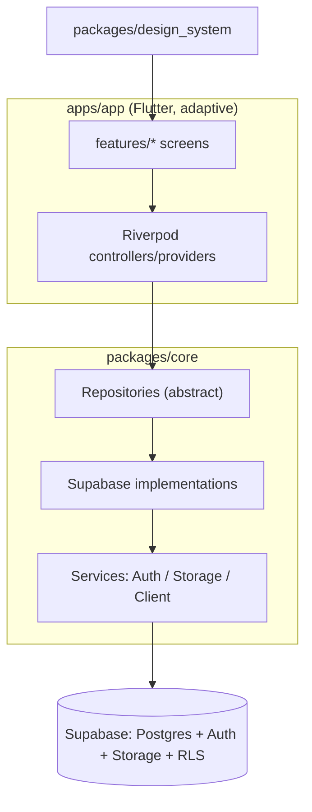
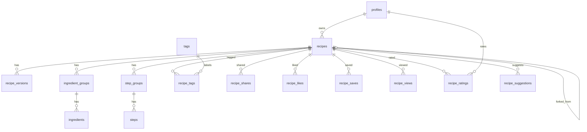

# SDS — Software Design Spec — Secret-Sauce

Authoritative design reference. Kept in sync with the code.

## 1. Overview

Secret-Sauce is a cross-platform recipe vault. Users create richly structured recipes, keep them
private or public, share privately with specific users, and **fork** others' recipes (git-style)
with a **version history** so recipes and their improvements are preserved across generations.

### Goals

- Make recipe **structure and instructions** clear and easy to follow.
- Preserve legacy recipes (attribution + story, immutable version snapshots).
- Enable sharing, discovery, and safe forking/improvement.

### Non-goals (now)

- Upstream "suggest changes" (PR-like) flow — schema hook reserved, UI deferred.
- Real-time collaborative editing.

## 2. Architecture

Single **adaptive** Flutter app; shared logic/UI in packages.



- UI → Riverpod → Repository (abstract) → Supabase impl → Supabase.
- UI never calls Supabase directly.
- Authorization is enforced by **RLS**; client checks are UX-only.

### Layers

| Layer         | Location                     | Responsibility                         |
| ------------- | ---------------------------- | -------------------------------------- |
| Presentation  | `apps/app/features/*`        | Screens, adaptive layout               |
| Design system | `packages/design_system`     | Theme, reusable widgets (`RecipeCard`) |
| State         | `apps/app` (Riverpod)        | Controllers, view-models               |
| Domain/Data   | `packages/core/repositories` | Contracts + Supabase impls             |
| Services      | `packages/core/services`     | Client bootstrap, auth, storage        |

## 3. Data model

### 3.1 Enums

- `difficulty`: `easy` \| `medium` \| `hard`
- `recipe_visibility`: `private` \| `public`
- `share_permission`: `view` (reserved: `edit`)
- `suggestion_status`: `open` \| `accepted` \| `rejected` (reserved for future PR flow)
- `chef_tier`: `home_cook` \| `line_cook` \| `sous_chef` \| `head_chef` \| `master_chef`

### 3.2 Tables

**profiles** — 1:1 with `auth.users`
`id (uuid, PK, = auth.uid)`, `display_name`, `avatar_url`, `bio`, `created_at`,
`chef_score (numeric)`, `chef_tier (chef_tier)`, `public_recipe_count (int)`,
`total_likes / total_saves / total_views (bigint)`.
Created by the `on_auth_user_created` trigger. Every other table's `user_id` is an FK to
**profiles**, not `auth.users`, so a missing profile row breaks rating/saving/view logging for
that account — `0001_init.sql` therefore backfills profiles from `auth.users` on every apply
(the trigger only fires on insert, so it cannot repair users that predate it; see B015).

The three `chef_*` columns and the three `total_*` columns are **denormalized aggregates** over
the engagement counters of the profile's *public* recipes — never written by the client; the
`on_recipe_stats_change` trigger recomputes them from scratch. See §10.

**recipes**
`id`, `owner_id → profiles`, `title`, `description`, `cover_image_url`, `cuisine`,
`category`, `difficulty`, `prep_minutes`, `cook_minutes`, `servings`,
`visibility`, `attribution` (legacy: original creator/story),
`forked_from_recipe_id → recipes` (nullable), `forked_from_version_id → recipe_versions` (nullable),
`current_version_id → recipe_versions` (nullable), `like_count`, `save_count`, `view_count`,
`rating_sum (numeric)`, `rating_count (int)`, `rating_avg (numeric(3,2))`,
`nutrition (jsonb, nullable)`, `created_at`, `updated_at`.

The three `rating_*` columns are **denormalized aggregates** — never written by the client;
the `recipe_ratings` trigger recomputes them from scratch so they cannot drift.

`nutrition` (Phase 28) is the per-serving nutrition-facts label, and it is deliberately **one
jsonb column rather than eleven `numeric` ones**: the writable-recipe-column set is restated in
about thirteen places across SQL, Dart, and the authoring tooling, so one column costs each copy
a line where eleven would cost eleven. Four rules follow.

- **`null` means "no nutrition info", and it is the only spelling of it.** An all-empty entry is
  normalized to `null` in the editor before it reaches the repository; the detail screen's
  Nutrition tab branches on exactly that.
- **The key set is fixed at 11 optional non-negative numbers** — `calories`, `total_fat_g`,
  `saturated_fat_g`, `trans_fat_g`, `cholesterol_mg`, `sodium_mg`, `total_carbs_g`,
  `dietary_fiber_g`, `total_sugars_g`, `added_sugars_g`, `protein_g`. Postgres cannot check the
  interior of a `jsonb`, so the constraint `recipes_nutrition_is_object` only insists the value is
  an object; `RecipeNutrition` in core and `_nutritionKeys` in `tool/recipe_format.dart` are what
  pin the keys, and the authoring validator treats an unknown one as a hard error.
- **Values are per serving at the recipe's own `servings`, and nothing multiplies them.** Scaling
  4 → 8 doubles the batch *and* the servings, so a serving is unchanged; the servings stepper moves
  the label's servings line and its batch total, never a row.
- **JSON null is not SQL NULL.** `_writablePayload` always sends the key, so a recipe with no
  label arrives as `"nutrition": null`, and `p_payload -> 'nutrition'` returns `'null'::jsonb` —
  which fails the typeof check. Both `save_recipe` branches therefore write
  `nullif(p_payload -> 'nutrition', 'null'::jsonb)`, with `->` and never `->>` (there is no
  implicit text→jsonb cast). `supabase/tests/rls_matrix.sql` asserts both halves.

It is client-writable, so it appears in both column grant lists, in `_writablePayload`, in
`save_recipe`'s two branches, in `fork_recipe`'s insert list, and in `kRecipeSelect`.
`recipe_snapshot` needed no change — it is `to_jsonb(r) - 'search_tsv'`, so version snapshots pick
the column up on their own.

**recipe_versions** — git-like immutable snapshots
`id`, `recipe_id → recipes`, `version_number (int)`, `parent_version_id → recipe_versions` (nullable),
`author_id → profiles`, `change_summary`, `content_snapshot (jsonb)` (full recipe body at that point),
`created_at`.

`content_snapshot` is **write-only from the client's point of view**: `save_recipe` writes it and no
UI reads it. `RecipeRepository.versions()` therefore selects `kRecipeVersionSelect` — every column
*except* the snapshot — because the v2 detail header watches that provider on every page open and
the snapshot is a whole recipe of `jsonb` per row (B065). `RecipeVersion.contentSnapshot` decodes to
its `@Default({})`. A future diff/restore feature needs the column and must take its own read for
the one version it is showing, not widen this list.

**ingredient_groups**: `id`, `recipe_id`, `name` (e.g. "For the sauce"), `sort_order`.
**ingredients**: `id`, `group_id → ingredient_groups`, `quantity (numeric, nullable)`,
`unit`, `name`, `note`, `is_optional (bool)`, `sort_order`.

**step_groups**: `id`, `recipe_id`, `name`, `sort_order`.
**steps**: `id`, `group_id → step_groups`, `step_order (int)`, `text`, `image_url`,
`duration_minutes`, `temperature`, `tip`, `sort_order`.

**Ordering contract.** Groups and their children are stored and presented in **ascending**
`sort_order` (`step_order` for steps), assigned `0..n-1` by `RecipeRepository._persistContent` in
list order. Reads must ask for ascending **explicitly** — postgrest-dart's `.order(column)`
defaults to `ascending: false`, and omitting the flag reversed every recipe's steps and
ingredients (B022). The invariant is load-bearing beyond display: `update()` re-persists the list
it just read, so a reversed read writes a reversed order back, and `recipe_versions.content_snapshot`
inherits whatever order the read produced.

**Draft-model completeness contract.** The recipe editor does not patch a recipe — it hands
`update()` a whole `Recipe`, and `_persistContent` **deletes** the recipe's groups and re-inserts
that value. So the editor's mutable draft types in
[edit_models.dart](../apps/app/lib/features/recipe_editor/edit_models.dart) must carry **every**
column of `Ingredient` and `RecipeStep`, including ones with no input yet: a field a draft drops on
load is a field the next save erases from the database. This was live for `temperature`,
`duration_minutes`, `tip`, `image_url`, `note` and `is_optional` (B035). `steps.image_url` has no
picker today and is carried through verbatim for exactly this reason. Adding a column to either
model means adding it to the draft in the same change; `recipe_editor_test.dart`'s round-trip group
is what fails if it is not.

**tags**: `id`, `name (unique)`. **recipe_tags**: `recipe_id`, `tag_id` (PK pair).
Tags are a **shared, unowned namespace**: readable by all, creatable by any signed-in user (a tag
must exist before a recipe can reference it), never updatable, and deletable only while nothing
references them (OPT-A6). Insert-only was the earlier state, which made one typo permanent for
everyone; deleting a tag still in use would cascade `recipe_tags` rows out of other people's
recipes and rewrite their search documents, so the `not exists` guard is the safety property.

**recipe_shares**: `recipe_id`, `shared_with_user_id → profiles`, `permission (share_permission)`,
`created_at` (PK: recipe_id + user).

**recipe_likes** / **recipe_saves**: `user_id`, `recipe_id`, `created_at` (PK pair).
**recipe_views**: `id`, `recipe_id`, `user_id (nullable)`, `viewed_at`. An append-only log — every
visit inserts a row. The `on_view_insert` trigger rolls it into `recipes.view_count`, counting
**distinct signed-in viewers**: a user's second-and-later row for the same recipe is ignored, and
anonymous rows (`user_id is null`) never count at all. The probe is a read-then-write, so it takes
a per-(recipe, user) `pg_advisory_xact_lock` — without it two concurrent first-views from one
account both bump. Deliberately has no unique constraint, so `logView()` stays a plain insert
(PostgREST cannot express `on conflict` inference against a partial index) and the full log
survives for later analytics.

`view_count` is **monotonic and therefore an upper bound**, not an exact distinct count: nothing
decrements it, and `user_id` is `on delete set null` (unlike `recipe_likes`/`recipe_saves`, which
cascade and fire their DELETE branch), so a deleted account's contribution stays and a
re-registered user counts again.

**recipe_ratings**: `user_id`, `recipe_id` (PK pair), `rating (numeric(2,1))`, `created_at`,
`updated_at`. One row per user per recipe — re-rating overwrites. `rating` is constrained to
**0.5 … 5.0 in half-star steps** (`rating * 2 = floor(rating * 2)`). An `after insert/update/delete`
trigger calls `recompute_recipe_rating(recipe_id)`, which rewrites `recipes.rating_sum`,
`rating_count`, and `rating_avg`.

**recipe_suggestions** _(reserved stub — not wired to UI)_
`id`, `recipe_id (target)`, `from_recipe_id (fork source)`, `author_id`, `status (suggestion_status)`,
`summary`, `payload (jsonb)`, `created_at`.

### 3.3 ERD



## 4. Row-Level Security

- **recipes SELECT**: `visibility = 'public'` OR `owner_id = auth.uid()` OR exists row in
  `recipe_shares` for `(recipe_id, auth.uid())`. Written **inline against the row's own columns**,
  deliberately not as `can_read_recipe(id)` (B053): Postgres applies the SELECT policy to the rows
  an `INSERT … RETURNING` returns, and a `stable` function reads the statement snapshot, which
  cannot contain the row being inserted — so every `create()` failed. Inlining also removed a
  `security definer` call per scanned row (2.4× faster on a Discover scan at sim `medium`). Keep
  this policy free of any self-referencing lookup on `recipes`.
- **recipes INSERT/UPDATE/DELETE**: `owner_id = auth.uid()`.
- Child tables (ingredients/steps/versions/…): access derived from parent recipe visibility.
- **recipe_shares**: recipe owner manages; shared user can read own rows. Because a non-owner's
  revoke matches 0 rows rather than erroring, `unshare()` asks for the deleted row back and throws
  `WriteDeniedException` when none comes — otherwise the dialog reports someone removed while they
  keep access (OPT-S2; same treatment as `recipes` update/delete).
  **Who** a share goes to is a UI decision, not a database one: `display_name` is not unique
  (the sim carries three "Amara Baptiste"s), so `ProfileRepository.searchByName` returns a ranked
  list — exact, then prefix, then contains, LIKE wildcards in the query escaped — and ShareDialog
  makes the reader pick before Share is enabled (OPT-A5). The old exact-`ilike` + `limit(1)`
  shared with whichever row came back first and reported success.
- **likes/saves**: user manages own rows; counts denormalized on `recipes` via triggers. The read
  test is asymmetric on purpose (B061): `with check` requires `user_id = auth.uid()` **and**
  `can_read_recipe(recipe_id)`, so a signed-in user who guesses a private recipe's uuid cannot
  like it into an inflated `like_count` the owner later publishes; `using` stays
  `user_id = auth.uid()` alone, so an existing like can always be removed. Putting the read test
  in `using` too would strand every liker's row the moment an owner flipped a recipe to private,
  and the unlike would then match 0 rows and report success.
- **views**: anyone who can read a recipe may log a view, including anonymous visitors — but only
  as themselves: `views_insert`'s `with check` requires `user_id is null or user_id = auth.uid()`,
  so a view cannot be attributed to another user. Only the recipe owner can read the log.
  Anonymous rows never move `view_count`, because `anon` holds `insert` on the table and counting
  them would make `recipes_trending` inflatable without an account.
- **counter/aggregate triggers** (`on_like_change`, `on_save_change`, `on_view_insert`,
  `on_rating_change`) are
  `security definer`: they write a `recipes` row the acting user does not own, which plain
  invoker rights would let RLS drop silently (see B011). Their helpers (`bump_count`,
  `recompute_recipe_rating`) have EXECUTE revoked from `public` / `anon` / `authenticated`, so
  PostgREST cannot expose them as RPCs.
- **ratings**: readable by anyone who can read the recipe; a user may write only their own row
  (`user_id = auth.uid()`), only for a recipe they can read, and **never for a recipe they own** —
  self-rating is rejected by the `with check` clause, not just hidden in the UI.
- **profiles**: readable by all; writable only by self. The `chef_*` columns are therefore
  world-readable, which is why the chef score counts **public recipes only** — private-recipe
  engagement (reachable through `recipe_shares`) must not leak into a public number.
  `on_recipe_stats_change` is `security definer` for the same reason `on_like_change` is: the
  acting user is the liker/viewer, not the recipe owner, and `profiles_update` is self-only
  (B011). `recompute_chef_stats` has EXECUTE revoked from `public`/`anon`/`authenticated`.
- **grants**: RLS chooses rows, `GRANT` chooses tables — both are required. The schema grants
  `select` on all public tables to `anon` + `authenticated`, DML to `authenticated`, and
  `insert on recipe_views` to `anon`. Without this a fresh Supabase project returns
  `permission denied for table ...` for every request (B013).
- **column grants (B050, fixed by OPT-S1)**: RLS filters rows and *cannot* filter columns — a
  `with check` expression sees the row, never which columns the statement assigned. Row-scoped
  `recipes_update` / `profiles_update` therefore let an owner `PATCH` **any** column of their own
  row, including `like_count` and `chef_score`, which `recipes_chef_stats` then recomputed *from
  the forged counter* and published to the leaderboard. `recipes` and `profiles` consequently
  drop the blanket `insert, update` grant and hold explicit column lists mirroring
  `_writablePayload` and `ProfileRepository.updateMine`; every server-owned column
  (`like_count`, `save_count`, `view_count`, `rating_*`, `current_version_id`, `created_at`,
  `updated_at` / `chef_score`, `chef_tier`, `public_recipe_count`, `total_likes`, `total_saves`,
  `total_views`) is excluded, as is `owner_id`
  on UPDATE so a recipe cannot be reassigned. **A new client-writable column must be added to
  that list or the first save carrying it fails `42501`.** Nothing reached through a
  `security definer` function or run as `postgres` (seed, sim, triggers) is affected.
- **`current_version_id` is genuinely server-owned** as of OPT-S1: the
  `recipe_versions_set_current` trigger moves the pointer when a version row is appended. The
  repository used to PATCH it directly, which is why it could not stay out of the grant list
  before. The trigger is `security definer` — under column grants an invoker-rights UPDATE of an
  ungranted column raises `42501` instead of silently matching 0 rows.

- **fork_recipe**: `security definer`, so it opens with its own authorization checks —
  `auth.uid() is null` (signed-in only) then `can_read_recipe(p_source)`. EXECUTE is revoked from
  `public` (what PostgREST exposes as an RPC) and `anon`, and granted back to `authenticated`, so
  an anonymous call is refused at the API edge as well as in the body (OPT-S6).
- **save_recipe**: same shape — `security definer`, `auth.uid()` check, then `owns_recipe(...)`
  (the identical predicate `recipes_update` uses, so the two cannot drift), EXECUTE revoked from
  `public`/`anon` and granted to `authenticated`. Both refusals raise `42501`, which the
  repository turns back into `WriteDeniedException` (OPT-A1).

### 4.1 The acceptance matrix (`supabase/tests/rls_matrix.sql`)

Everything above is asserted by one file, run with `melos run db:rls` and by CI's `database.yml`.
It exists because every other thing that touches this schema — `seed.sql`, the sim,
`3_sim_verify.sql`, the CI job's other steps, every hosted check — runs as `postgres`, which
bypasses policies outright. `anon` was proven by hand in Phase 26; **`authenticated` had never been
exercised at all**, which is the gap B053 lived in for months and where B061 was found.

It creates three throwaway `auth.users` (an owner, someone the owner shares a private recipe with,
an unrelated signed-in stranger) plus a private and a public recipe with content, re-runs the whole
matrix under `set local role authenticated` + `request.jwt.claims`, and **rolls the transaction
back** — so it leaves no user, no recipe and no helper function behind and is safe against any
database. 79 checks; a failure names the check and what actually happened.

Its one helper, `rls_matrix_do(text)`, executes an arbitrary string as the calling role, which is
how a "must FAIL" check is written without aborting the run. That is also a PostgREST RPC shape
(Gotcha 3), so it carries three locks: it refuses unless a **transaction-local** GUC arms it, it is
dropped before the `rollback`, and `supabase/scripts/drop.sql` drops it too.

Two shapes it is built around, because both look exactly like working code:

- an `update`/`delete` RLS denies matches **0 rows and returns success** (Gotcha 2) — so those
  checks assert the row count, not the absence of an error;
- a SELECT policy that cannot see its own `INSERT … RETURNING` row (B053) — asserted longhand, so
  "raised an error" and "succeeded but returned nothing" are distinguishable.

**Trigger:** any change to a policy, a `security definer` function, or the column grants.

## 5. Forking & versioning

- **Edit** → append a `recipe_versions` row (`version_number = max+1`, `parent_version_id` = prior),
  set `recipes.current_version_id`. Snapshots are immutable → full lineage retained.
- **All of that is one call** (OPT-A1). `save_recipe(p_recipe_id, p_payload, p_ingredient_groups,
  p_step_groups, p_change_summary)` creates-or-updates the row, replaces both group trees, and
  appends the version in a single transaction; `create()`/`update()` in the repository are that
  call plus one `getById` for the return value. It replaced a client-side sequence of an update,
  two deletes, one insert per group and per child, a read, and a version insert — with three
  consequences:
  - **No content-loss window.** A failure between the deletes and the re-inserts used to leave a
    recipe with its title saved and its content gone. Commits or does not.
  - **No `version_number` race.** The number is `max(...) + 1` read *after* the `update recipes`
    takes the row lock, so a concurrent save of the same recipe waits and then sees it.
  - **`sort_order` is the array index**, assigned in SQL from `with ordinality` — the same rule the
    client applied, so the editor's ordering semantics are unchanged (B022).
- **Snapshots are built by `recipe_snapshot(uuid)`**, `to_jsonb(row) - 'search_tsv'` at all four
  levels with explicit ordering. It is also what `fork_recipe` now stores: the fork's first
  version used to be a literal `'{}'`, a version row that recorded nothing.
- **Fork** → deep-copy recipe + its groups/ingredients/steps into a new recipe owned by the forker;
  set `forked_from_recipe_id` and `forked_from_version_id`. Independent thereafter.
- **Attribution** → `recipes.attribution` free-text preserves legacy origin/story; detail screen
  also shows "Forked from {title} by {owner}" when lineage exists.
- **Future PR flow** → `recipe_suggestions` reserved so a fork can later propose changes upstream.

## 6. Discovery & ranking

- **Access**: Discover, search, and public recipe detail are open to anonymous (signed-out)
  visitors — RLS `recipes SELECT` already permits reading `public` recipes without auth. Sign-in
  is only required for creating/editing, My Recipes, Profile, and owner actions (share, fork).
- **Recent**: `ORDER BY created_at DESC` over public recipes.
- **Popular**: ranked by **star rating**, using a Bayesian (weighted) average so a single 5-star
  recipe does not outrank a 4.8 with hundreds of ratings:

  ```text
  score = (rating_sum + m * C) / (rating_count + m)     m = 5, C = site-wide mean rating
  ```

  `m` phantom ratings sit at the site mean `C` (`sum(rating_sum) / sum(rating_count)` over public
  recipes, defaulting to 3.5 when nothing is rated yet); real ratings pull the score away from that
  prior. Ties break on `rating_count`, then `save_count + like_count`, then `created_at`.
- **Trending**: recency-weighted score, e.g.
  `score = (like_count + view_count) / pow(hours_since_created + 2, 1.5)`. Both inputs are
  one-per-user by construction (`recipe_likes` PK, `on_view_insert` dedup), so the score cannot be
  driven up by repeat traffic from one account or by anonymous visitors. **Candidates are bounded
  to the last 30 days** (OPT-P2): `now()` inside the score makes the sort key non-indexable, so
  the only lever is how many rows get scored. The bound is free in ranking terms — at 30 days the
  divisor is ≈19,400, so an older recipe cannot place — but it does mean Trending is **empty**
  when nothing public was created in 30 days. Deliberate; Popular and Recent still show everything.
  `recipes_public_created_idx` — partial on `(created_at desc) where visibility = 'public'` —
  backs both this window and Recent's ordering.
- **Search**: Postgres full-text over title (weight A) + description (B) + ingredient names and
  tag names (C), read from the trigger-maintained `recipes.search_tsv` column with a GIN index
  (OPT-P1). The document spans four tables, so a Postgres **generated** column cannot express it —
  it is a plain column plus triggers, which is also what makes it indexable.
  `recipe_search_tsv(uuid, text, text)` is the single definition; it takes title and description as
  arguments because the `recipes` BEFORE trigger cannot read its own row back on INSERT.
  Child-table triggers are **statement-level with transition tables** (an editor save re-inserts
  every ingredient at once). A group cascade-delete is handled by the group's own trigger, since by
  the time the ingredient trigger runs the group row is gone and the join back to `recipe_id` finds
  nothing. `search_tsv` is server-owned: not in the column grants, written only by
  `security definer` triggers, and excluded from `kRecipeSelect` so it never ships to a client.

### 6.0 Shelves (Phase 26)

Discover leads with three horizontal **shelves**, defined in
`supabase/migrations/0001_init.sql`. They answer a different question from the three
rankings above: not "what is doing well" but "what am I in the mood for".

| Shelf | Predicate | Ranked by |
| --- | --- | --- |
| `01 UNDER 30` (`recipes_quick`) | `prep_minutes + cook_minutes` **between 1 and 30** | Bayesian rating, then the Popular tie-breaks |
| `02 WEEKEND PROJECTS` (`recipes_projects`) | total `> 0` **and** (total `>= 120` **or** `difficulty = 'hard'`) | `save_count`, then `like_count` |
| `03 MOST FORKED` (`recipes_most_forked`) | has at least one **public** fork | fork count, then `save_count + like_count` |

Four things about this are load-bearing:

- **One signal per shelf.** Three shelves ordered by the same key are one shelf shown three times.
  A weeknight recipe is chosen on whether it is any good, a project on whether it is worth a
  Saturday (a save is the "when I have a day" signal; a rating comes from whoever already got to
  the end), and a fork shelf can only rank on forks. Each shelf **prints its own rule** in the
  header.
- **The time floor is not cosmetic.** `between 1 and 30` excludes recipes with no timings: an
  unrecorded duration is unknown, not zero, and `RecipeCard` renders exactly that case as `—`.
  `recipes_projects` applies the same `> 0` floor to both branches of its `or`.
- **`recipes_most_forked` counts public forks only.** These RPCs are invoker-rights, so an
  unqualified `count(*)` over `recipes` is filtered by RLS — a private fork would count for its
  owner and for nobody else, and the same recipe would hold a different rank depending on who
  asked. It aggregates first and joins back (the fork set is small and
  `recipes_public_fork_source_idx` covers it) rather than running a correlated count per candidate.
- **`site_rating_prior()`** is the `m = 5` prior above, hoisted out of `recipes_popular`'s inline
  CTE so `recipes_quick` shares one definition (Gotcha 19). It is cross-joined, i.e. evaluated once
  per query — as a per-row scalar it would re-scan every public recipe for every public recipe.
  `recipes_popular` reads it too; its order is unchanged by the extraction.

Both shelves keyed on time and the fork shelf are **empty on a seed-only database** — the 14
authored recipes top out at 85 minutes, none is `hard`, and none has been forked. The page says so
in place of the rail. **That includes the hosted project**, which carries no simulated population:
measured there 2026-08-23, the shelves return 10 / 1 / **0** rows, so `MOST FORKED` is empty on
production by construction until a real user forks something. See the BL-5 register in
[ROADMAP.md](./ROADMAP.md#bl-5--seed--sim-coverage-register-read-this-when-planning-a-feature)
before "fixing" it — running the sim against hosted is a one-way door. The population comes from the sim, where a fork's source is drawn weighted by
that recipe's reach (`sim.fork_bias` in `supabase/sim/0_sim_schema.sql`, applied in
`2_sim_generate.sql` §5) so the tree has a trunk to rank.

The shelves do **not** page: each is one request for 12 rows, with no `Load more` and no
"see all" route. `p_offset` exists on all three RPCs, so that is a screen, not a query.

### 6.1 Paging (OPT-P9)

Every browsing surface reads **one page at a time** and grows by an explicit `Load more`:
Discover's four lists and both My Recipes tabs. Before this, Discover was capped at 20 (30 for
search) with no way to see row 21, and `listMine` / `listSharedWithMe` were unbounded.

- `recipes_popular(p_limit, p_offset)`, `recipes_trending(p_limit, p_offset)`,
  `recipes_search(p_query, p_limit, p_offset)` — `p_offset` added to all three, and each order-by
  now ends in `created_at desc, id` so the ordering is **total**. That tie-break is what makes
  `offset` meaningful at all: rows with an equal score (very common for `ts_rank`) would otherwise
  be free to swap between the page-1 and page-2 queries, showing one recipe twice and hiding
  another. The pre-`p_offset` signatures are dropped in `0001_init.sql` itself and listed in
  `drop.sql` (B024).
- Table-backed lists page with PostgREST `.range(offset, offset + limit - 1)` under the same
  total-order rule: Recent orders `created_at desc, id desc`; `listMine` `updated_at desc,
id desc`; `listSharedWithMe` `recipe_shares.created_at desc, recipe_id desc` (the shares row is
  what is being paged, not the embedded recipe).
- Client state is `PagedRecipesNotifier` (`core/src/paging.dart`), an `AutoDisposeAsyncNotifier`
  holding a `RecipePage` (rows, `hasMore`, `loadingMore`). `hasMore` means "the last fetch came
  back full" — the only evidence `limit`/`offset` gives without a `count(*)` per page — so a total
  that is an exact multiple of `kRecipePageSize` (20) costs one empty request at the end.
  `loadingMore` lives in the data rather than in an `AsyncLoading`, so the rows stay on screen
  while the next page loads; a failed page leaves the list untouched and rethrows for a snackbar.
  Rows already on screen are dropped from an incoming page by id, since a deletion between two
  requests genuinely shifts the window.
- **Load more, not infinite scroll** — a product decision: an explicit tap behaves the same under
  a phone flick and a desktop scrollbar, and never fetches a page nobody asked for.

## 7. Screens

| Screen         | Route                             | Notes                                                                                 |
| -------------- | --------------------------------- | ------------------------------------------------------------------------------------- |
| _(none)_       | `/`                               | **Redirect-only** — forwards to `/discover`. The landing screen was retired: it had no entry point in either chrome (the web brand mark already went to Discover), so it was reachable only by cold start. |
| Sign in / up   | `/auth`                           | Supabase auth                                                                         |
| Discover       | `/discover`                       | Masthead + search, three shelves (`01 UNDER 30`, `02 WEEKEND PROJECTS`, `03 MOST FORKED` — §6.0), then one browse grid sorted Top rated / Trending / Newest. No `AppBar`: the masthead is the title. Public, no sign-in |
| Chefs          | `/chefs`                          | Leaderboard ranked by chef score (public, no sign-in)                                 |
| My Recipes     | `/my`                             | Tabs: My / Shared-with-me; `RecipeCard` grid with Public/Private badges                |
| Recipe detail  | `/recipe/:id`                     | **Two layouts, one screen (§7.1).** Expanded (≥ 1000) renders the v2 reading page: measured 1140px column, header band, facts strip, ingredients rail / method column. Compact and medium keep the v1 hero + single column. Both: servings scaler, rating, like/save **toggles**, fork, versions (public recipes viewable signed-out; like/save/rate send a signed-out visitor to `/auth` rather than calling the repository — B051) |
| Recipe editor  | `/recipe/new`, `/recipe/:id/edit` | Structured create/edit                                                                |
| Profile        | `/profile`                        | Current user                                                                          |

### 7.1 Recipe detail: the two layouts (Phase 27)

`recipe_detail_screen.dart` branches on `context.isExpanded` and nothing else: expanded windows get
`RecipeDetailExpanded`, everything below gets `RecipeDetailCompact`. The branch is deliberately a
single check rather than an `AdaptiveLayout` with three builders — there is no medium-specific
design, and pretending otherwise would freeze a layout nobody drew.

**Both layouts are v2. The v1 hero is deleted** — a 240px `SliverAppBar` over one padded `Column`,
plus `recipe_content_views.dart`, removed when compact v2 landed. Compact serves **compact *and*
medium**: the canvas draws no medium screen, a single-column cover-first page reads correctly at
800px, and keeping v1 for the 600–1000 band would have meant a third layout for a width nobody drew.

| | Compact (< 1000, frames B/F) | Expanded (≥ 1000, frame A) |
| --- | --- | --- |
| Measure | full width, single column | centred, capped at `kDetailPageWidth` (1140), two columns |
| Identity | full-bleed cover with floating chrome, then title / chef / rating / description / attribution | header band: version line, title, description, attribution, chef + rating, action row; cover as a 400×280 card beside it |
| Metadata | `FactsStrip(quad: true)` — Total · Hands on · Difficulty · **Longest wait** as 2×2 | `FactsStrip` — the same four plus Cook and Visibility, one row of labelled cells |
| Visibility | a `Private` badge on the cover | a facts cell |
| Navigation | **pinned jump bar** — Ingredients / Method / Fork | none needed; both columns are on screen |
| Rail | `RailPanel(bordered: false)` — full width, no card edge | `RailPanel()` — a bordered column beside the method |
| Steps | `MethodColumn` | `MethodColumn` |
| Cook mode | `Ready to cook?` pinned below the scroll, plus the method teaser | the header band button, plus the method teaser |

The two content panels are **one implementation each**, differing only in `bordered`. That is
deliberate: B066 was two copies of the ingredient list disagreeing across this very branch.

**The rail is a tab host (Phase 28).** `RailPanel` renders, top to bottom: `ServingsRow` → two
`ChoiceChip`s → the active pane, which is `IngredientRail` or `NutritionTab`. Four parts of that
shape are load-bearing:

- **The stepper is above the tabs, not inside a pane.** Nutrition depends on the serving count
  exactly as the ingredient list does — the label's batch line is calories × the selected
  servings — so a stepper trapped behind the other tab would make that line unexplainable, and a
  second stepper in the nutrition pane is B066 by construction. Both panes and cook mode read the
  one `selectedServingsProvider`.
- **The card border belongs to the host**, which is why `bordered` moved off `IngredientRail`. The
  pane swap then happens inside one frame instead of exchanging two differently-bordered boxes.
- **The tabs are `ChoiceChip`s in a `Wrap`, not a `SegmentedButton`.** Compact's content box is
  358px and a segmented control is one intrinsic `Row` with no reflow escape (Gotcha 21) — the
  same reason the three rows inside the ingredient pane are `Wrap`s.
- **`railTabProvider` is `autoDispose`**, so every visit opens on Ingredients. Compact's
  `_jumpToIngredients` tear-off also resets it, so the pinned jump chip cannot scroll to a section
  whose list is hidden behind the other tab.

`NutritionTab` renders `NutritionFactsLabel` (design_system) or `No nutrition info available`, and
the branch is simply `recipe.nutrition == null`. The label is store-label styling in `onSurface`
tokens — no literal black anywhere, so dark mode holds — omits every row with no value, and prints
`% Daily Value` from the FDA 2,000-calorie constants in `core/src/nutrition_facts.dart`. It never
multiplies a per-serving number (see §3.2).

Things about the v2 page that are load-bearing and easy to undo by accident:

- **`Longest wait` is derived, not stored.** It is the longest single `steps.duration_minutes` in the
  recipe — the number that answers "can I cook this tonight". Nothing persists it; adding a column
  for it would put it in `kRecipeSelect`, the grants block and `save_recipe` (Gotcha 11/17) to save
  a `max()` over data already loaded.
- **Only quantities scale.** The rail multiplies `quantity` by `servings / recipe.servings` and
  colours the changed ones `primary`; step durations and temperatures are never touched. Made
  visible by the "Scaled from N" note, and read by cook mode too (§7.2).
- **`ingredients.quantity` is nullable, so the gutter has a fallback chain**: `quantity + unit`, else
  the bare `unit`, else the `note` ("to taste"), else `—`. All four states are reachable from the
  editor — a quantity field that fails to parse (`1/2`) saves the unit with no number — and the unit
  must survive that, because v1 prints it either way (B066). The unit outranks the note because a
  unit with no number is a data defect worth seeing; the note then rides beside the name instead, so
  neither half is dropped. The note takes the gutter **only** when it is the one thing there, which
  is also the only case it is not repeated beside the name.
- **The rail is bounded against text scale, not fixed.** `kDetailRailWidth` (352) and
  `kIngredientQuantityGutter` (86) are both multiplied by
  `context.textScale.clamp(1.0, kDetailRailMaxScale)` (1.4). At 2.0× a fixed rail turns every
  ingredient name into a three-line wrap, and the cap is what keeps the method column the wider of
  the two. B062–B064 are what happens without this and without the `Wrap`s beside it.
- **Compact's two fixed-height regions are the pinned jump bar and the bottom bar**, and they are
  bounded differently on purpose. The jump bar is a `SliverPersistentHeader`, which has exactly one
  height — so a `Wrap` cannot reflow inside it and a `Row` of intrinsic chips is the Gotcha 21
  overflow; its content **scrolls horizontally** instead, and only the height is scaled against
  `context.textScale`. The `Ready to cook?` bar sits **outside** the scroll as
  `Column(Expanded(scroll), bar)` rather than in a `Stack` over a reserved padding, because its own
  height grows with text scale and any reserve constant would be wrong at some scale.
- **A widget's envelope is the set of widths it has been pumped at.** The rail was green for a week
  and overflowed the moment compact reused it at 358px instead of the expanded page's 493px column
  (B070). Giving an existing widget a new caller re-opens its envelope; re-run it. Phase 28's rail
  restructure re-opened it again, which is why both detail suites now run their envelope matrix
  **per tab** and `NutritionFactsLabel` carries its own at {320, 358, 493} × {1.0, 2.0}.

Checked ingredients and done steps live in `checkedIngredientsProvider` / `doneStepsProvider` —
**not** `autoDispose`, because leaving the screen mid-cook and coming back must not clear the
checklist. They are session state, not device state, and the UI says so.

### 7.2 Cook mode (`/recipe/:id/cook`, Phase 27)

A **mode**, not a third layout of the recipe: its own route on the root navigator, its own session
state, and its own theme. Canvas frames C (phone step), D (phone timer), E (finish), H (web).

| | Compact (frames C/D) | Web ≥ 1000 (frame H) |
| --- | --- | --- |
| Step text | `headlineSmall`, one step fills the screen | `displaySmall` — readable across a kitchen |
| Timer | ring stacked over the controls | ring beside them |
| Ingredients | `You'll need` chips at the bottom | a 400px rail: this step's ingredients + `Coming up` |
| Advance | a 52px `Done — next step` bar you can hit with a knuckle | buttons + space / ← → / esc |

**It is always dark.** `CookModeScreen` pins `AppTheme.dark()` regardless of the platform setting —
the only screen in the app that overrides the theme — because the phone is propped on a counter
under kitchen lighting and a light page is glare. The pin sits *outside* the `AsyncValue` branch so
the loading and error states are dark too; a white flash on the way in is the glare the mode exists
to avoid.

**The step model keeps its groups.** Steps are stored grouped, and the grouping is not decoration:
the header reads `Filling · step 1 of 3` and numbering restarts per group, while `Step 5 of 9`
counts overall, and the progress bar is one segment per group **weighted by step count** (a 4-step
crust and a 2-step bake are not halves of the same job). `flattenCookSteps` produces the flat walk
with both positions on every entry; `cookSegments` produces the bars. A group with no steps is
dropped — it would otherwise earn a zero-width segment and a heading for nothing. Segment fill
counts steps *behind* the cook, so landing on a group's first step fills nothing.

**Timers: several at once, one ticker.**

- A timer is seeded from `steps.duration_minutes`. A step without one gets **no** timer rather than
  a default — a clock on "Serve with rice" is worse than no clock.
- Several may run simultaneously **by design**: a chill or a bake keeps counting while the cook
  moves on, which is the only reason a step timer beats a kitchen timer. `CookSessionNotifier`
  drives them all from a single `Timer.periodic`, so the cost is independent of how many there are
  and there is exactly one thing to cancel on dispose.
- **The alarm is state, not an event.** `CookSessionState.ringing` holds step ids until
  acknowledged, so a bake that finishes while the cook is reading step 3 is still ringing when they
  look up. An event would be lost on the rebuild the step change causes — precisely the case that
  matters.
- The chime is Flutter's own `SystemSound.play` + `HapticFeedback.vibrate`: **no dependency, and
  therefore foreground-only.** The UI's copy is "Keep this screen open" and "Chime when a timer
  ends", not the canvas's "screen stays awake" / "alarm rings even with the screen off" — those need
  `wakelock_plus` and `flutter_local_notifications` with platform config, deferred (ROADMAP Phase
  27). Adding either plugin means changing that copy in the same commit.

**"You'll need" is derived, and there is no schema behind it.** No `step_ingredients` table exists
and nothing on `steps` points at an ingredient row. `stepIngredients()` reads the step's own prose
instead: an ingredient matches when a distinctive word of its name appears in the step text as a
**whole word**, with a stop-word list dropping the words ("chopped", "fresh") that would attach half
the list to every step. Word-wise rather than whole-name because the stored name is rarely the
phrase the step uses — "boneless chicken thigh" appears as "the chicken". Whole-word is what makes
it safe: `\bbutter\b` does not fire on "buttermilk". Consequences: a step naming nothing hides the
panel rather than showing an empty one, and "add the remaining spices" finds nothing. **It is a
hint, not a checklist**, and cook mode keeps a pointer to the full list for that reason.

**Session lifetime and shared state.** `cookSessionProvider` is a `NotifierProvider.family` on the
recipe id and is **not** `autoDispose` — backing out to check the ingredient list must not throw
away a running timer. Cook mode reads the *same* `selectedServingsProvider` the reading page writes,
so a recipe scaled to 8 servings says 8 in both places; two surfaces printing different quantities
for one ingredient is the B066 class of bug, which is also why both quantity gutters read
`ingredientQuantityLabel` from core rather than each carrying a copy.

**The finish screen is where the rating gets asked** — the one moment the cook knows the answer. It
writes through the same `setRating` path as the reading page, so RLS is still what forbids rating
your own recipe; the owner branch explains it rather than enforcing it. It reports wall-clock
elapsed against `recipe.totalMinutes`, and is a *state* of the session, not a dead end: "not done —
back to the last step" returns. The canvas's "note for next time" is **not drawn**, because
`recipe_ratings` has no column for it (see ROADMAP Phase 27 for what adding one costs).

### Adaptive behavior

- Narrow (< 600): bottom navigation, single-column lists.
- Wide (≥ 600): fixed top navigation bar, multi-column grids, side-by-side detail.
- Breakpoints centralized in `design_system/layout/adaptive.dart`.

#### Navigation chrome (the one place the platforms diverge)

The bottom bar is mobile, the top bar is web; everything under the chrome is shared. Both read
their destinations from `apps/app/lib/routing/nav_destinations.dart`, and the two lists differ:

| | Destinations | Identity | New recipe |
| --- | --- | --- | --- |
| Compact (< 600), `NavigationBar` | Discover, Chefs, My Recipes, **Profile** | — | extended FAB |
| Web (≥ 600), `TopNavBar` | Discover, Chefs, My Recipes *(signed in only)* | avatar → account menu | on the page (My Recipes header) |

`TopNavBar` (`apps/app/lib/routing/top_nav_bar.dart`) is brand · centred destination pill ·
identity, and nothing else — that is what takes the row from ~700px to ~470px, which is what it
has to fit at 600.

- The pill is centred **on the bar**, not between the clusters: a `CustomMultiChildLayout`
  measures both side clusters and reserves `max(brand, actions)` on each side.
- **Labels never wrap.** The pill measures its labels with a `TextPainter` at the live text scale
  and takes the widest mode that fits — all labels (expanded), active label only (medium, or
  expanded when the measurement says so), icons only with the label as a tooltip. The bar's own
  height scales with the text scaler up to 1.6×.
- Signed out, the actions are `Sign in` + `Sign up` (`/auth?mode=signup`), collapsing to a single
  filled `login` button at medium; My Recipes is not offered, since it could only redirect.
- Signed in, the avatar is the account control: `ChefAvatar` with a `primary` ring and a tier dot,
  fed by `myProfileProvider`, opening a menu of Profile / Sign out. `/profile` is therefore a
  shell route with **no** selected destination — the pill highlights nothing there.

**Two different rules, on purpose.** Navigation chrome switches at the breakpoints
(`responsiveColumns`, `AdaptiveLayout`, `context.isCompact`) — it is a different layout on each
side. The **recipe grid does not**: it flows. `FlowGridMetrics.fit` takes the width actually
available and fits as many columns as can each hold `kRecipeCardMinWidth` (288), caps every tile
at `kRecipeCardMaxWidth` (340), and splits whatever is left over into an equal gutter on each
side so a capped row stays centred. A window drag therefore adds a column at the width where one
genuinely fits, instead of stretching three cards across 1400px and then jumping at 1000.

| Available width | Columns | Card width | Gutter |
| --------------- | ------- | ---------- | ------ |
| 358 (phone)     | 1       | 340 (capped) | 9    |
| 768             | 2       | 340 (capped) | 36   |
| 968             | 3       | 312        | 0      |
| 1408            | 4       | 340 (capped) | 0    |

The floor moved from 264 to **288** on 2026-08-20 (B048). 264 bought an extra column out of the
footer: at that width the metadata row had to ellipsize `4.9 (8)` to fit, which is a truncation
the card was never meant to reach at default text scale. A column fewer is the cheaper trade —
1408px now packs four cards at the cap rather than five squeezed ones.

The cap belongs to the **grid**, not the card: a grid cell hands its child tight constraints,
which win over any `ConstrainedBox` inside `RecipeCard`, so the only way to hold a tile at 340 is
to hand the delegate less width to divide (that is what the gutter is). `FlowGridMetrics` is pure,
so it is unit-tested directly across a continuous 288→2400 sweep rather than at sampled widths.

## 8. RecipeCard contract

Inputs: cover image, name, short description, cook time (prep+cook), average star rating
(hidden until the recipe has at least one rating), difficulty badge. `showVisibility: true`
adds a public/private chip to the title banner — used on My Recipes, where both kinds are listed.
`showChef` (default true) overlays the owning chef on the cover, bottom-right, whenever
`recipe.owner` is embedded; My Recipes turns it off, since every card there has the same owner.
Used across Discover and My Recipes.

**Anatomy (v2 — the name leads the card).** Top to bottom:

| Band       | Content                                                                                                    | Sizing                          |
| ---------- | ---------------------------------------------------------------------------------------------------------- | ------------------------------- |
| **Banner** | Recipe name on `colorScheme.primary` / `onPrimary`, `titleMedium` w700, **max 2 lines** then ellipsis, vertically centred; the icon-only visibility chip sits at its end | **fixed band** — `kRecipeCardBannerHeight` (65) × `context.textScale` |
| **Cover**  | Cover image (or the `surfaceContainerHighest` + menu-glyph fallback), chef overlay bottom-right on a scrim   | **flexible — absorbs the slack** |
| **Footer** | Description (2 lines, ellipsized), an `outlineVariant` rule, then the time · rating · difficulty row         | intrinsic                       |

The name is first so it never competes with the photo for the top of the card and stays legible
over a dark or busy cover. A two-line title takes its height **from the cover**, not from the card.

**The banner is a fixed band, not an intrinsic one** (B047). It is two lines' worth of
`titleMedium` with the title centred inside it, so a one-line name and a two-line name produce
the *same* banner and every cover in a grid row starts at the same y — previously a one-line
title gave a visibly shorter band than its neighbour's two-line one. The height is a **minimum**
scaled by `context.textScale`: a hard 65px would clip two lines of 2.0× type, and text that still
needs more grows the band (and costs the cover) rather than overflowing. The factor is clamped at
`kRecipeCardBannerMaxScale` (2.0): the card's total height is fixed, so an unbounded band starves
the cover and then overflows — 65 × 3.0 is 195px of banner in a 352px card. Past the ceiling the
title's own two lines drive the band, and 130px still holds them at 3.0×, so the one-line /
two-line match survives the clamp. The card's 3.0× height budget is a separate, pre-existing
problem (B049).
`packages/design_system/test/recipe_card_test.dart`'s `title banner` group pins both halves —
the two line counts share a centre, and a longer title clamps at two lines instead of adding a
third.

**The card is a fixed-height, bounded-width tile**: `kRecipeCardHeight` (352), passed by
`recipe_grid.dart` as the grid's `mainAxisExtent`, and `kRecipeCardMinWidth` (288) /
`kRecipeCardMaxWidth` (340), which the grid turns into a column count (see §7 *Adaptive
behavior*). It is not a fixed *aspect* — that was the retired card's `childAspectRatio: 0.82`,
which left dead space under every card once the window got wide. `RecipeCard` applies the height
itself, so an unbounded-height parent cannot leave the cover's `Expanded` unbounded (the original
B001 shape); it does **not** apply the width cap, because a grid cell's tight constraints would
override it.

**Both overlays live on the cover `Stack` or in the banner, never in the footer column.** The tile
cannot grow, and all three logged overflow bugs (B001/B002/B016) came from adding an
intrinsically-sized child to a band that had no slack. The cover has slack; the banner and footer
do not — which is also why the visibility chip is **icon-only with the label as a `Tooltip`**: a
"Private" label next to a two-line title is the first thing to overflow at 2.0× text scale.

The banner is drawn in the theme's `titleMedium`. The Claude Design mockup sets it in Newsreader;
shipping that is the app-wide typography decision (`google_fonts` + a `textTheme` in
`app_theme.dart`), not a card-level choice — see ROADMAP Phase 20.

### Rating widgets (`design_system`)

| Widget            | Use                                                                 |
| ----------------- | ------------------------------------------------------------------- |
| `StarRating`      | Read-only 5-star display with half stars, value, and rating count   |
| `RatingPill`      | Compact single star + value, for dense surfaces (`RecipeCard`)      |
| `StarRatingInput` | Interactive half-star input; `onChangeEnd` fires when a gesture ends |

### Nutrition widgets (`design_system`)

| Widget | Use |
| --- | --- |
| `NutritionFactsLabel` | The per-serving nutrition panel, drawn like the label on a store product: heavy outer rule, `Nutrition Facts` masthead, servings and per-serving lines, oversized Calories row, right-aligned `% Daily Value` column, sub-rows indented under fat / carbs / total sugars, and the 2,000-calorie footnote. Takes a `RecipeNutrition` plus the selected and base serving counts (`design_system` already depends on `core`, so it takes the model directly). Three properties are the contract: **a row with no value does not render** — a label carrying only calories is a short label, not a column of dashes; **no per-serving number is ever multiplied** — `servings` moves the servings line and the batch total only (§3.2); and there is **no hard-coded black** — ink is `onSurface` on `surface`, so dark mode holds and the label's weight comes from rule thickness and type weight instead. The %DV arithmetic and the value trimming live in `core/src/nutrition_facts.dart`, not here, because a future editor preview or export computes the same numbers (the OPT-A7 rule). Envelope pinned at {320, 358, 493} × {1.0, 2.0} — the widths the two detail rails actually hand it |

### Chef widgets (`design_system`)

| Widget      | Use                                                                                    |
| ----------- | -------------------------------------------------------------------------------------- |
| `TierChip`  | Tier pill (icon + label); `dense` drops the icon. `colorFor(tier, brightness)` is the shared accent, also used by the leaderboard rank medallion |
| `ChefAvatar` | The circle alone: photo when there is one, `initialsFor(name)` when there is not. Optional `ringColor` (a `surfaceColor` gap then a ring) and `tier` (rank dot, bottom-right) — both used by the web top navigation, where the avatar *is* the account control and has to carry rank at 34px. Ring and dot are drawn **outside** the circle, so a ringed avatar is wider than `radius * 2` |
| `ChefBadge` | `ChefAvatar` + name with the `TierChip` **under** the name; `compact` for dense surfaces, `onSurfaceImage` for the card's cover overlay. `ChefBadge.fromProfile(recipe.owner!)` is the usual call |
| `ChefStandingCard` | One leaderboard row, in two shapes chosen by `variant`. `podium` (default) is the full-width row: tier spine, medal for ranks 1–3, four labelled stat chips, `34% to Master`. `board` is the dense row for the chefs page's 404px panel: rank pill instead of a medal, no stat chips, a 3px tier progress bar on the bottom edge. One widget, not two, so the two rows cannot drift |
| `ChefSpotlightCard` | A chef as a collectible card (draft `1e`): tier-gradient foil frame, portrait window with serial and rank, rarity band, a "driver" row naming the input contributing most, the four totals, and the tier-ladder bar. Renders entirely from one `ChefStanding` — **no per-card fetch** |
| `SpotlightCardPlaceholder` | The same frame and geometry with neutral bands. Holds a shelf whose data does not exist yet, or one still loading |
| `CardRail` | A titled horizontal shelf of fixed-width cards with prev/next arrows and a `1–3 / 10` position label. Generic over its children (the **caller** sizes its tiles — a horizontal `ListView` gives a child a tight height and an unbounded width); a horizontal `ListView` + `animateTo`, so a trackpad and a drag work as well as the arrows. Two headers, chosen by `variant`: `badged` is the chefs page's icon tile over title/subtitle; `numbered` is Discover's set numeral, spaced-caps title, hairline rule and ranking kicker (§6.0). One widget, because the scroll controller, the pitch arithmetic and the position window are the substance and neither header changes them |
| `RecipeCardPlaceholder` | `RecipeCard`'s geometry — the same banner/cover/footer bands — in neutral fills, so a loading shelf holds its height instead of collapsing and dragging every shelf below it up the page. `SpotlightCardPlaceholder`'s counterpart for recipes |

Per-tier colors are defined as a light/dark pair — the light shades are unreadable on dark
surfaces and vice versa, so `colorFor` resolves against `Theme.of(context).brightness`.

`StarRatingInput` maps the left half of star _n_ to `n - 0.5` and the right half to `n`, and
previews during a drag; the caller persists on `onChangeEnd` so a drag writes once, not per frame.
If the gesture is **cancelled** — an ancestor scroll view claims it after a press-and-hold — the
preview is dropped and `onChangeEnd` never fires, so the stars never show an unsaved value (B017).

The `RecipeCard` metadata row (time · rating · difficulty) is width-adaptive: the time label and
both `RatingPill` texts are `Flexible` and ellipsize in that order, inside an `Expanded` group.
A fixed-height grid tile cannot grow, so the row degrades instead of overflowing at narrow widths
or large text scale (B016). The `DifficultyBadge` is the row's **only non-flex child** — it takes
its intrinsic width, sits flush right, and is capped at half the row by a `LayoutBuilder` +
`ConstrainedBox`. Giving it a flex instead makes `RenderFlex` reserve half the row for it whatever
its label says (B026); giving it no cap overflows by 1px at the narrowest column / 2.0×. Since
B048 the *floor* is set so this row never has to degrade at default text scale: 288px is the
width at which `12h 45m` + `4.5 (1250)` + `Medium` all fit uncut. Widget tests cannot assert
that — `flutter test` renders in a fixed-width font far wider than Roboto, so they assert *no
overflow* and the uncut claim is a screenshot check.

**`ChefSpotlightCard` is the second fixed-size tile in the kit, and it obeys the same rules with one
addition.** Every band except the portrait is intrinsic and comes out of a fixed budget, so a longer
name eats portrait height rather than growing the card. What `RecipeCard` does not have to solve is
that the spotlight card's intrinsic bands — header, rarity band, driver row, stat grid, ladder line —
already exceed its 356px budget well before 2.0× text scale, so no flexible band can absorb the
growth. The tile therefore grows *with the text and only with the text*:
`spotlightCardHeight(context) = 356 + (textScale − 1) × 168`, clamped at 2.5×, after which the
portrait absorbs the remainder. A rail scrolls inside a page that scrolls, so a taller card costs
nothing; dropping bands would hide data instead. `context.textScale` (`adaptive.dart`) is the shared
measurement — it scales a real font size rather than reading the raw factor, because `TextScaler` is
non-linear above 1.0 on some platforms.

Its header and driver rows repeat the `DifficultyBadge` lesson verbatim: the score and the points
are **non-flex inside a `ConstrainedBox`** cap, not `Flexible` beside an `Expanded`. Two flex
children split a row 50/50 whatever the content, which truncated the chef's name at half the card
while a shorter score left dead space beside it (B038). A non-flex child of a `Row` is laid out
**unbounded**, so anything in that position also needs the cap — the rank pill did not have one and
ran past the portrait edge at 3.0× (B039).

## 9. Security notes

- No secrets in source; Supabase keys via `--dart-define` / env.
- All authorization via RLS; never rely on client filtering for privacy.
- Storage buckets scoped; signed/public URLs per bucket policy. Both buckets carry the full
  read/insert/update/**delete** set, each scoped to a folder named for the uploader's uid — the
  avatars bucket was missing delete until OPT-A6, so every superseded avatar stayed readable at a
  guessable path in a public bucket.
- **Error text is mapped, never dumped** (OPT-A4). Every user-facing failure goes through
  `friendlyError()` in `core`, which turns a `PostgrestException` into one actionable sentence and
  keeps the raw object in `debugPrint`. Screens used to render `e.toString()`, which put table
  names, SQLSTATE codes, and query fragments on screen — free schema disclosure to anyone who can
  make a request fail.

## 10. Chefs, tiers & leaderboard

> Status: **implemented (Phase 18).** The schema, columns, and screens described here exist;
> §3, §4, §7, and §8 carry the summary and this section is the detail. Execution detail:
> [EXECUTION-PLAN.md Phase 18](./EXECUTION-PLAN.md#phase-18--chefs-tiers--leaderboard).

### 10.1 Concept

Every user **is** a chef — "chef" is a presentation of `profiles`, not a new table or role. A
chef has a **tier**, derived from a **chef score** computed over the engagement counters
(`like_count`, `save_count`, `view_count`) of the **public** recipes they own. Recipes already
have exactly one chef: `recipes.owner_id → profiles` is non-null, and a fork produces a *new*
recipe owned by the forker (lineage tracked separately via `forked_from_*`) — no schema change
is needed for the "one recipe : one chef" rule; it holds by construction.

### 10.2 Score & tiers (server-owned, tunable in one place)

Postgres enum `chef_tier`, mirrored in `enums.dart` — this makes **five** mirrored enums:

```
chef_tier: home_cook | line_cook | sous_chef | head_chef | master_chef
```

Two immutable SQL functions are the single source of truth — changing the formula or the
thresholds is a one-function edit plus the idempotent backfill that already runs on every apply:

```text
chef_score(likes, saves, views) = 3·likes + 5·saves + 0.2·views      -- over PUBLIC recipes only
chef_tier_for(score):  ≥ 20000 → master_chef
                       ≥  5000 → head_chef
                       ≥  1000 → sous_chef
                       ≥   100 → line_cook
                       else    → home_cook
```

Rationale: a save is the strongest intent signal, a like weaker, a view weakest (and `view_count`
is a deduped, anon-excluded upper bound — see §3.2 / B012 — so it is safe to include at low
weight). Ratings are deliberately **not** in v1 of the formula (the request scopes ranking to
popularity/likes/saves); a Bayesian rating term is the obvious v2 refinement. Thresholds are
inclusive (`>=`) and the seed pins a boundary case to prove it.

**Only public recipes count.** Private-recipe engagement (possible via `recipe_shares`) must not
leak into a world-readable number. Flipping a recipe private drops its contribution on the next
recompute; deleting it likewise.

**One client-side mirror, and it is documented as a mirror.** `ChefScoring`
(`core/src/chef_scoring.dart`) restates the three weights and the four thresholds in Dart. It has
to: the expanded chef card (§10.6) prints `1,980 likes × 3 = 5,940` and `9,811 points to Master
Chef`, which cannot be derived from a stored score alone. Nothing in the app writes a score or a
tier from it — every stored value still comes from the SQL — so the mirror is a *presentation* of
server truth, not a second source of it. `packages/core/test/chef_scoring_test.dart` pins every
weight and every threshold boundary against the SQL literals, so changing one side without the
other fails the suite instead of shipping a card that explains a formula the database does not use.

### 10.3 Storage: denormalized onto `profiles`, recomputed from scratch

Follows the `recipes.rating_*` precedent exactly — denormalized aggregates, recompute-from-scratch
(never incremental), trigger-maintained, **server-owned** (client never writes them):

- `profiles.chef_score numeric not null default 0`
- `profiles.chef_tier chef_tier not null default 'home_cook'`
- `profiles.public_recipe_count int not null default 0`
- `profiles.total_likes / total_saves / total_views bigint not null default 0` (OPT-P5) — the
  three sums `chef_score()` is computed from. The recompute already produced them and threw them
  away, so the leaderboard re-derived them per page with a full aggregate over `recipes`; they
  are written by the same statement that writes the score, so a total can never disagree with the
  score it explains. `bigint` for the same reason `chef_score()` takes bigints: `view_count` is
  unbounded.

(added via `alter table … add column if not exists`, per the idempotency rule).

- `recompute_chef_stats(p_chef uuid)` — one set-based UPDATE aggregating that chef's public
  recipes. Invoker-rights, EXECUTE **revoked** from `public`/`anon`/`authenticated` (the
  `bump_count` rule — every `public` function is otherwise a PostgREST RPC).
- `recompute_all_chef_stats()` — the whole-table form, same revokes. Three callers need exactly
  this statement (the idempotent backfill, `sim/2_sim_generate.sql`'s bulk load with the trigger
  disabled, `sim/9_sim_teardown.sql` after deleting behind the triggers' backs) and all three used
  to restate it; one function is what keeps Gotcha 19 enforceable.
- `profiles_leaderboard_idx` — partial index on `(chef_score desc, public_recipe_count desc,
  display_name asc, id asc) where public_recipe_count > 0`: exactly the board's ordering over
  exactly the board's rows. It replaced `profiles_chef_score_idx` (same leading columns, no
  filter, no other reader).
- Trigger `on_recipe_stats_change` on `recipes`: `after insert or delete or update of like_count,
  save_count, view_count, rating_sum, rating_count, visibility, owner_id`, recomputing
  `new.owner_id` (and `old.owner_id` when it differs, and on delete). **Must be
  `security definer set search_path = public`** — it updates a `profiles` row the acting user
  (liker/viewer) does not own, and `profiles_update` RLS is self-only; invoker rights would
  silently update 0 rows (B011 class). No recursion: it writes `profiles`, never `recipes`.
- Idempotent backfill in `0001_init.sql` (B015 precedent): one set-based UPDATE recomputing all
  profiles on every apply of the baseline — this is also how a formula/threshold change reaches
  existing rows. It is the reason the baseline is frozen and changes go in new migrations
  (OPT-A9): re-running it to ship an unrelated one-liner recomputes every profile.
- `supabase/scripts/drop.sql` gains: the trigger's function, `recompute_chef_stats(uuid)`,
  `recompute_all_chef_stats()`, `chef_score(...)`, `chef_tier_for(numeric)`,
  `chefs_leaderboard(int, int)`, and `drop type if exists chef_tier`.

Why denormalize instead of computing at read time: the chef badge renders on **every recipe
card**, so tier must arrive with the recipe list in one query (PostgREST embedding, §10.5) —
a per-card RPC would be an N+1, and a batched "tiers for these owners" RPC pushes orchestration
into every list provider. Cost: one extra single-row `profiles` write when a recipe's counters
move. Acceptable at this scale.

### 10.4 Leaderboard RPC

```sql
chefs_leaderboard(p_limit int default 50, p_offset int default 0)
  returns table (chef_rank bigint, id uuid, display_name text, avatar_url text,
                 chef_tier chef_tier, chef_score numeric, public_recipe_count int,
                 total_likes bigint, total_saves bigint, total_views bigint)
```

- `stable`, invoker-rights, **callable by `anon`** — the leaderboard page is signed-out safe,
  like Discover. Since OPT-P5 **every column is read off `profiles`**; the function aggregates
  nothing. That also removes the trap the old version dodged by hand: its recipe sums had to
  filter `visibility = 'public'` explicitly, because under invoker RLS a signed-in chef would
  otherwise have seen their own private recipes folded into their totals. The persisted columns
  are public-only by construction, and `profiles` is world-readable, so every viewer reads the
  same row. Measured at sim `medium`: **3.5 ms → 0.5 ms** warm (52 ms cold).
- `chef_rank` = `dense_rank() over (order by chef_score desc)` — tied scores share a rank.
  Deterministic full ordering: `chef_score desc, public_recipe_count desc, display_name asc,
  id asc`.
- **Excludes chefs with `public_recipe_count = 0`** (tasters, private-only chefs, brand-new
  accounts). They still *have* a tier (`home_cook`) for badge purposes; they just don't occupy
  leaderboard rows.

**Top recipes for one chef** (Phase 22), behind the expanded chef card:

```sql
chef_top_recipes(p_chef uuid, p_limit int default 3) returns setof recipes
  order by chef_score(like_count, save_count, view_count) desc,
           save_count desc, like_count desc, created_at desc, id
```

- `setof recipes` like the three Discovery RPCs, so the caller reuses `kRecipeSelect` and the
  `Recipe` model — no new decode path, and the owner embedding still rides along.
- Ordered by the **same** `chef_score()` the leaderboard aggregates, so "top by points
  contributed" cannot drift from the score it explains. PostgREST cannot `order` by that
  expression, which is why this is an RPC rather than a `.order()` on the table.
- `stable`, invoker-rights, `anon`-callable, and `visibility = 'public'` filtered explicitly —
  same reasoning as `chefs_leaderboard`, including for the chef's own dialog.

### 10.5 Client data path

- `Profile` model gains `chefScore`, `chefTier`, `publicRecipeCount` (JSON keys = column names).
  `ChefTier` enum decodes with `unknownEnumValue: ChefTier.homeCook` so an older client survives
  a future tier addition.
- `Recipe` model gains an optional embedded `Profile? owner`, populated by the `kRecipeSelect`
  fragment in `core/src/repositories/recipe_queries.dart`, which is used by `getById`,
  `listMine`, `listSharedWithMe`, and all four Discover queries (PostgREST accepts `.select()`
  embedding on the RPCs too, since they return `setof recipes`). Null-safe: surfaces that don't
  embed simply render no badge.

  **The FK hint is mandatory.** The obvious `owner:profiles(...)` does **not** work — `recipes`
  and `profiles` are related five ways (`owner_id`, plus many-to-many through `recipe_likes`,
  `recipe_ratings`, `recipe_saves`, `recipe_shares`), so PostgREST rejects the ambiguous form
  with `PGRST201: Could not embed because more than one relationship was found`. The working
  fragment is:

  ```text
  *,owner:profiles!recipes_owner_id_fkey(id,display_name,avatar_url,chef_tier)
  ```

  Dropping the hint breaks every recipe query at once, which is why the fragment is a single
  shared constant rather than repeated per call site.
- `ChefRepository` (abstract + `SupabaseChefRepository`, same file, wired in
  `core/src/providers.dart`): `leaderboard({int limit, int offset})` → `List<ChefStanding>`,
  `topRecipes(chefId, {limit})` → `List<Recipe>`, and `tierCounts()` → `Map<ChefTier, int>`.
  `ChefStanding` is a freezed model mirroring the RPC row. Signed-out safe by construction
  (no `_uid` use). `chef_score` is Postgres `numeric`, so it decodes through
  `(v as num).toDouble()` — a bare `as double` would throw on a whole-number score.

  `tierCounts()` is the chefs hero's five tiles, and since OPT-P10 it is **one**
  `chefs_tier_counts()` RPC. PostgREST cannot express `group by`, which is why this used to be
  five separate exact-count requests plus a sixth for the total; an RPC can, so it does. The
  function drives off `unnest(enum_range(null::chef_tier))` left-joined to `profiles`, so a tier
  with no chefs still returns a row and the hero keeps its stable five-tile row. It filters
  `public_recipe_count > 0` — the same population `chefs_leaderboard` ranks.

  **There is no `chefCount()`.** The board's denominator — the "of 148" in `Rank 2 of 148` — is
  the sum of the tier counts, because both cover that same population, so asking the server
  separately was a sixth round trip for a number the first call already contained.
  `chefCountProvider` derives it, and the four call sites share the single fetch.

  Decoding the RPC's bare `chef_tier` label uses `ChefTier.fromWire`, the inverse of
  `ChefTier.wireValue` — the Postgres enum label restated on the enum, because
  `json_serializable` keeps its `@JsonValue` mapping private to generated code.
  `chef_models_test.dart` pins each pair by round-tripping it through the decoder.
- Feature providers (`features/chefs/chefs_providers.dart`): `chefsLeaderboardProvider`,
  `chefCountProvider`, `chefTierCountsProvider`, and `chefDetailProvider(chefId)` — the last
  returning a `ChefDetail` (profile + top recipes). The recipe read is caught and flagged rather
  than thrown: everything else in the card comes from the `ChefStanding` the board already holds,
  so a database without `chef_top_recipes` applied loses one section instead of the whole dialog.

  `leaderboardPagesProvider` (a `StateProvider<int>`) is what `Show all 148` bumps.
  `chefsLeaderboardProvider` watches it and requests `kLeaderboardPageSize × pages`, so "more" is a
  **wider first page**, not a second one stitched on. The RPC ranks the whole table and returns a
  prefix, so re-reading 50 ranked rows costs less than the bookkeeping to avoid it and cannot drift
  out of order the way an accumulated list can.

### 10.6 UI

- **`TierChip`** (`design_system`, exported from the barrel): compact pill with tier icon +
  label. Fixed English labels ("Home Cook" … "Master Chef"); per-tier accent colors defined as
  theme-aware tokens (must pass light + dark).
- **`ChefBadge`** (`design_system`, exported): avatar + display name with the `TierChip` **under
  the name** (per the product requirement), plus a `compact` variant and an `onSurfaceImage` flag
  for the cover overlay. Falls back to initials without an avatar, and to "Unnamed chef" on an
  empty display name.
- **`RecipeCard`**: the badge **overlays the cover image, bottom-right** (a `Positioned` in the
  existing `Stack`, diagonally opposite the banner's visibility chip), on a scrim, name ellipsized.
  It must NOT be a new row in the footer column: the card is a fixed-height tile
  (`kRecipeCardHeight`) and three prior overflow bugs (B001/B002/B016) all came from adding
  intrinsic children to a band with no slack.
  Renders only when `recipe.owner != null` and `showChef` is true (My Recipes turns it off —
  every card there has the same owner). Regression tests at the standard envelope: both ends of
  the card's width range (`kRecipeCardMinWidth` 288 and `kRecipeCardMaxWidth` 340), longest tier
  label, 2.0× text scale.
- **Recipe detail**: full-size `ChefBadge` under the title (tap target reserved for a future
  chef-profile page).
- **Chefs screen** `features/chefs/` at **`/chefs`**, inside the `ShellRoute`, on the nav
  destination lists (trophy icon, "Chefs") — signed-out safe, so **no** change to the router's
  `needsAuth` list. Standard loading/empty/error states throughout.

  Since Phase 23 it renders **three layouts**, and which one is chosen depends on the text scale as
  well as the width:

  | Condition | Layout |
  | --- | --- |
  | `context.isCompact` | The Phase 22 board, unchanged: one 760px column of `podium` rows, no hero |
  | expanded **and** `textScale ≤ 1.3` | Hero, then two independently scrolling columns — a 404px leaderboard panel and the rails |
  | otherwise | One scroll: hero, rails, then the panel sized to its content |

  The text-scale bound is not cosmetic. The two-column layout is
  `Column(hero, Expanded(Row(panel, rails)))`, so all three regions must fit the viewport at once
  and the hero is a **non-flexible** child taking its intrinsic height — at 2.0× it was taller than
  a 1200px window and the `Expanded` below could not absorb it (B037). Above the bound the page
  becomes one scroll, which has no such constraint.

  The draft pins the panel with `position: sticky` inside a scrolling page. Two columns each owning
  their scroll under a fixed hero renders the same picture: the draft already gives the panel its
  own `max-height: 675px` scroll container, and the Flutter equivalent of sticky is a nested-scroll
  arrangement with more to get wrong.

  The panel's footer carries `Show all N`, which widens the page rather than appending one.
- **`ChefsHero`** (`features/chefs/chefs_hero.dart`) — the banner: the live-recompute kicker, the
  population pill from `chefCountProvider`, the one-line ranking rule, five tier tiles from
  `chefTierCountsProvider`, and the All time / Month / Week filter. **Always dark, in both themes** —
  the gradient is a brand surface, not a scheme colour, so its foregrounds are literals and the tier
  accents resolve at `Brightness.dark` (the light shades are unreadable on it). Its three parts row
  only while the width clears `900 × textScale`, and stack below that: a fixed 900px meant the
  identity block was handed ~168px at 2.0× and the strapline wrapped to seven lines (B037).
- **Rails.** Three `CardRail`s of `ChefSpotlightCard`. Only **Popular** (all-time, straight off the
  leaderboard payload) has data; Trending and "best of the month" rank on engagement earned inside
  a time window, which nothing computes yet, so they render `SpotlightCardPlaceholder`s under a
  footnote saying why. The `Momentum` / `New` sort tabs and the hero's Month / Week are rendered
  **disabled with a tooltip** for the same reason — a control that is visibly not ready reads
  better than a drawn feature that silently does nothing. See §10.8.
- **`ChefStandingCard`** (`design_system`, exported) — the board row since Phase 22, the design's
  "podium" draft, and since Phase 23 the `board` variant too (see §8). A 6 px tier spine on the
  leading edge, a medal glyph for ranks 1–3 (a numeral
  plus the word `rank` below), the tier-tinted `ChefAvatar`, name + dense `TierChip`, the four
  engagement chips, and a score with `34% to Master` (or `top tier reached`) beneath it. The whole
  row is one tap target and opens the expanded card — the board's rows were inert before.

  Three layout rules, two of them learned the hard way (B023): the trailing score column is
  **width-bounded** and its number is a `FittedBox` rather than an ellipsis (a truncated score is
  worse than a small one); the stat labels are `Flexible` inside a `Wrap`, since a `Wrap`
  constrains each child to the wrap width and an intrinsically-sized `Text` in a `Row` cannot
  degrade; and the spine is a stretched `Row` child rather than an `IntrinsicHeight`, which would
  cost an extra layout pass on every one of 50 rows. Unlike `RecipeCard` this tile is **not**
  fixed-height — it is a list row and may grow — so a long name costs vertical space instead of
  overflowing.
- **Expanded chef card** (`features/chefs/chef_detail_sheet.dart`), opened by tapping a row. One
  body, two hosts: a centred `Dialog` capped at 1152 × 720 from `Breakpoints.compact` up, and a
  `showModalBottomSheet` at 94 % of the screen height on a phone (the default 9/16 cap cuts the
  ladder off). Two columns on desktop, stacked in a `ListView` on compact.

  Left/top — **why this score**: the tier-coloured total, then one `ScoreContributionBar` per
  input (`1,980 likes × 3` … `5,940`, bar = share of total) ordered by contribution, the
  "public recipes only" note, then a **`TierLadder`** and `9,811 points to Master Chef — about
  1,963 more saves, or 3,271 more likes`. Right/bottom — **top recipes** from
  `chef_top_recipes`, each row tapping through to `/recipe/:id`, then the four totals and a note
  that score and rank update on every like/save/view (there is **no** nightly job).
- **`TierLadder`** (`design_system`, exported): the four thresholds as **evenly spaced anchors**
  (100 / 1,000 / 5,000 / 20,000 at 0 / ⅓ / ⅔ / 1) with the fill interpolating between them. A
  linear points axis would squash Line Cook and Sous Chef into the first 5 % of the bar — useless
  for exactly the chefs who need to read it. `TierLadder.positionFor` is public and pinned by test.
- **`ChefSpotlightCard`** (`design_system`, exported) — a chef as a collectible card, draft `1e`.
  Everything on it comes from the one `ChefStanding` the rail already holds, which is the whole
  point: the draft's "move" row is the chef's signature dish, and a per-card recipe read would make
  a ten-card shelf eleven round trips. `1e`'s own note calls the second move *the chef's strongest
  stat*, and `ChefScoring.breakdown()` already ranks the three inputs — so the card prints
  `Driven by likes · 1,980 likes × 3 · 5,940` from the row it was handed, reusing the arithmetic the
  expanded card explains. Sizing rules in §8.

  The portrait window has **no chef portrait behind it**: there is no such asset and no column for
  one, so it renders `avatar_url` when there is one and the same monogram `ChefAvatar` used
  everywhere else when there is not. The serial reads `004 / 148` — rank over the board total (`chefCountProvider`) — with
  the draft's `SEASON 1` dropped, since no season model exists to back it.
- **Things in the mockup deliberately absent**: a `Follow` button and `View all N recipes` (no
  follow model, no public chef page — the top-recipe rows are the expanded card's only navigation);
  the season; and the draft's `RECOMPUTED 4H AGO`, which is simply wrong about this build — the
  hero says `LIVE · UPDATES ON EVERY LIKE, SAVE AND VIEW`, because `on_recipe_stats_change` fires
  on every one of them.

### 10.7 Seed & edge cases

Fixed-UUID chef accounts (`…00d1`–`…00d7`), passwords randomized exactly like the tasters
(B018 — `seed.sql` runs on production by documented procedure). `seed_recipe()` gained a
`p_visibility` parameter defaulting to `'public'` — a **signature change**, so the old 16-argument
signature is in `drop.sql` (Gotcha 5). Actual seeded standings:

| Chef | Name | Likes | Saves | Views | Score | Tier | Pins |
| ---- | ---- | ----- | ----- | ----- | ----- | ---- | ---- |
| d1 | Amara Okonkwo | 4000 | 1600 | 5000 | 21000 | `master_chef` | ≥ 20000, **summed across two recipes** |
| — | Secret Sauce Kitchen | 1228 | 941 | 9000 | 10189 | `head_chef` | lands there unassisted from the curated recipes |
| d2 | Bruno Castellani | 1000 | 400 | 2500 | 5500 | `head_chef` | ≥ 5000 |
| d3 | Chen Wei | 200 | 100 | 500 | 1200 | `sous_chef` | ≥ 1000 |
| d4 | Dara Nilsson | 20 | 8 | 0 | **100** | `line_cook` | exactly the threshold — proves `>=` is inclusive |
| d5 | Elif Yilmaz | 0 | 0 | 0 | 0 | `home_cook` | public recipes, zero engagement — ranked last |
| d6 | Farid Haddad | 5000 | 2000 | 10000 | **0** | `home_cook` | **private-only**: would score 27000 if private counted; absent from the board |
| d7 | Greta Lindqvist | 100 | 180 | 0 | **1200** | `sous_chef` | ties d3 via a different mix — proves `dense_rank` shares a rank |
| — | tasters ×8 | — | — | — | 0 | `home_cook` | no recipes — guard for the `public_recipe_count > 0` filter |

> **Since Phase 19, only the `d1`–`d7` rows come from `seed.sql`.** The Kitchen's recipes moved to
> `recipeData/` → `seed_recipes.sql`, taking their engagement counters and ratings with them as
> `demo` blocks. The 10189 / `head_chef` standing is unchanged and now comes from that file;
> `public_recipe_count` is 15, because the nine newly authored recipes carry no engagement and
> contribute 0 to the score. Verified after the move — see §11.

> **This table describes a *freshly seeded* database, and real traffic moves it — by design.**
> Checked against the hosted project on 2026-08-20: Amara reads **21000.2** and the Kitchen
> **10189.6**, not the round numbers above, because four views logged by actual app use raised
> `view_count` by 1 on each of four recipes and `chef_score` picked them up at 0.2 apiece. That is
> `on_view_insert` (B012) working end to end in production. Reconcile against a database that has
> just been seeded — `melos run db:reset`, or the local stack — never against one the app has been
> pointed at.

### 10.8 Known limits (accepted for v1)

- **Self-engagement counts.** Unlike ratings (RLS-blocked), a chef may like/save their own
  recipes, and sock-puppet accounts can inflate any input. `view_count` is already
  anon-proof/dedup'd (B012); likes and saves are one-per-account but account creation is free.
  Score is not money — deferred, noted here so it isn't rediscovered as a "bug".
- Tier thresholds are provisional product numbers; expect retuning once real data exists (the
  backfill-on-apply makes retuning a one-line change).
- No chef-profile page yet. Since Phase 22 a board row opens the expanded chef card, but there is
  still no route that lists one chef's public recipes, and the `ChefBadge` on a recipe card or on
  recipe detail is still not tappable-to-navigate.
- **The formula is public** as of Phase 22: the expanded card prints the multipliers. That is the
  point of the card — a chef could not otherwise tell what moves their score — but it also tells
  a would-be gamer that a save is worth 5× a view. Accepted alongside §10.8's self-engagement
  limit, which is the larger hole.
- **There is no windowed score.** Every number on `/chefs` is all-time. The Trending and
  best-of-the-month rails, the `Momentum` sort and the hero's Month / Week filter are drawn,
  disabled, and tooltipped as not-yet-wired (Phase 23, decision D4).

  The data exists — `recipe_likes.created_at`, `recipe_saves.created_at` and
  `recipe_views.viewed_at` are all there, so a windowed score is a query, not a new snapshot table.
  Two things must be true of whoever writes it:

  1. **The windowed view term must not count anonymous rows.** `recipes.view_count` deliberately
     ignores them because `anon` holds `insert` on `recipe_views` (B012); an aggregate over the raw
     log reopens exactly that inflation vector, this time on a ranking nobody is auditing. Count
     `distinct (recipe_id, user_id)` where `user_id is not null`.
  2. **Points must come from `chef_score()`**, never a restated `3 / 5 / 0.2`, or the window and
     the board drift (Gotcha 19).

  Note also that the rails will look empty against the current database even once built: `seed.sql`
  writes the counters directly and inserts almost no engagement rows. Seeding dated ones to fix
  that would fire the counter triggers and move every `chef_score`, invalidating the standings
  pinned in §10.7 — so the seed needs its own answer before the rails do.
- Rank is recomputed per request (no caching); fine at current scale.

## 11. Recipe content vs. demo data

Two seed files, split because they have different lifespans.

| | `supabase/seed.sql` | `supabase/seed_recipes.sql` |
| --- | --- | --- |
| What | Demo fixtures: the Kitchen + taster + chef **accounts**, the `d1`–`d7` demo recipes, and the rating machinery | All 14 of the Secret Sauce Kitchen's recipes |
| Authored in | the file itself | `recipeData/recipes/<slug>.json` |
| Generated | no | **yes** — `tool/recipes.dart`, committed |
| Lifespan | deleted once there is real traffic | permanent |
| Helper | `seed_recipe` (flat, one unnamed group) | `seed_recipe_v2` (group-aware) |

The Kitchen's six original recipes used to live in `seed.sql` as well; Phase 19 moved them out, so
each recipe now has exactly one definition. Their engagement counters and taster ratings came with
them as a `demo` block per recipe, and the resulting `chef_score` is byte-identical (10189,
`head_chef`).

Both files bootstrap the same Kitchen account (`…00aa`) with conflict guards.

**Content is order-independent; demo ratings are not.** `seed_recipes.sql` reaches `seed.sql`'s
taster pool through a `to_regprocedure('seed_ratings(uuid, jsonb)')` guard rather than a hard
dependency, so it keeps working after that file is deleted — but applied *first*, on a database
that has no tasters yet, it creates every recipe and skips every rating with a notice. Re-running
it after `seed.sql` backfills them via the early-return path (B014). `melos run db:reset` and
`config.toml`'s `db.seed.sql_paths` both order them `seed` → `recipes`.

### 11.1 Why the authoring format is not the scrape format

The recipes arrived as one flat array of `{"amount": "1 1/4 cup", "item": "flour"}` with free-text
`servings` and null times. That shape cannot drive this product:

- **The servings scaler multiplies `ingredients.quantity`, a Postgres `numeric`.** `"1 1/4 cup"`
  is not a number. `quantity` is authored as a decimal (`1.25`) with `unit` beside it.
- **`recipes.servings` is an `int`.** `"Makes 9-in Tart"` is not. Yield that is not a serving
  count goes in `description`.
- **`ingredient_groups` / `step_groups` exist** and a flat list wastes them. The teriyaki recipe
  is the proof: `tamari` appears at 2 tsp in the marinade and 1/4 cup in the sauce, which reads as
  a duplicate until the groups are named.
- **Unattended time is not prep time.** Chilling, rising, and marinating are a step's
  `duration_minutes`, so the detail screen shows a timer instead of the headline time inflating.

**`nutrition` (Phase 28)** is an optional object of 11 non-negative numbers, per serving at that
file's own `servings`. The format spells absence out as an explicit `"nutrition": null` rather
than an omitted key — twelve of the fourteen files carry that, and it is what exercises the
detail screen's empty state — and an empty object `{}` is a hard error, because `null` is the one
representation of "no info" everywhere else in the feature. Unknown keys are hard errors too: the
`jsonb` column would accept them and they would then decode to nothing, silently. `simData`
inherits all of this through its `$ref`, and **no dish authors one** — a label belongs to a recipe
as published, not to the dish idea, and hand-authoring 120 of them would be busywork with no
signal in it. The simulation generates them instead: `sim.nutrition_for(key, category)`
(`0_sim_schema.sql`) draws a label for each simulated recipe and `2_sim_generate.sql` writes it,
so a `db:sim` population carries ~1,320 varied labels. Three properties are what make it worth
looking at rather than merely non-null:

- **Derived from a calorie draw, not field by field.** Independent draws produce labels that do
  not add up — 200 kcal beside 40 g of fat — and looking like a real label is the panel's entire
  job. Calories are drawn per category, split into fat / protein / carb *energy* shares, and
  converted at 9 / 4 / 4 kcal per gram, so the macros reconstruct the calorie figure.
- **Ranges are per category**, held as rows in `sim.nutrition_profile` rather than a `case`
  ladder, so retuning one is a one-row update. Dessert and Drink draw high sugar, Main high
  protein and calories, Sauce and Side low everything.
- **Every sub-value is bounded by its parent** — saturated ≤ total fat, added ≤ total sugars,
  fibre + sugars ≤ carbs — with the bound applied *after* rounding, so rounding cannot push a
  child past it. A label that contradicts itself reads as data and is worse than no label.

About a fifth of simulated recipes get **no** label, because the empty state is a real state and a
population where every recipe has one cannot demonstrate it. Randomness is `sim.rand` only, so the
B044 guarantee holds: same seed → same labels. `3_sim_verify.sql` asserts all of it —
**D5** self-consistency, **D6** the exact 11-key set, **D7** non-negative numbers, **D8** that
both the labelled and unlabelled populations exist (without which D5–D7 are vacuous).

An authored dish label would still win: the generator writes
`coalesce(nullif(doc -> 'nutrition', 'null'::jsonb), sim.nutrition_for(…))`. The `nullif` is the
same JSON-null trap as everywhere else — a dish spelling the field out as `"nutrition": null`
yields a JSON null, not SQL `NULL`.

`seed_recipe_v2` gained `p_nutrition jsonb default null` as its **last** argument. That is a
signature change, so the previous 17-argument form is dropped in the generated file itself — not
only in `drop.sql`, which a plain re-apply never runs (B024 / Gotcha 5). Without that line the
upgrade path dies with `42725 … is not unique` while a fresh reset and a re-apply both stay green.

**The two dummy fixtures cannot reach production, by design.** `chicken-tikka-masala` and
`spring-vegetable-tart` carry all 11 fields at `10` so the label is inspectable on a local stack;
every `% Daily Value` they produce is nonsense. Because `seed_recipe_v2` early-returns on an
existing `(owner_id, title)`, a re-seed never pushes them to a database that already has those
recipes. Replacing them with real values is named deferred work, not an afterthought.

### 11.2 Identity and ordering

`slug` is the filename and a **repo-level** identity only — `recipes` has no slug column, and
`seed_recipe_v2` still dedupes on `(owner_id, title)`. So renaming `title` creates a second row,
and `seed_recipe_v2` is **not an upsert**: it returns early when the title already exists, leaving
content alone (it does still re-apply demo ratings — B014).

**Title is the uniqueness rule; content is not.** One chef may publish two recipes for the same
dish, however similar, provided the titles differ — that is a legitimate thing to do, and nothing
in the schema or the tooling discourages it. What is not allowed is two recipes with the *same*
title under one owner: the import silently collapses them into a single row instead of failing,
so `tool/recipes.dart` rejects a repeated title as an error before it can get that far.

Groups are `sort_order` 0..n in array order; `step_order` restarts at 0 **within each group**,
matching `SupabaseRecipeRepository._persistContent`. Numbering steps continuously across groups
would look right until the first edit re-persisted them per-group and silently renumbered
everything (the B022 failure mode).

### 11.3 Gaps

- `recipes` has no `notes` column, so a recipe-level note (a variation, a make-ahead) is appended
  to `description` by the generator. Lossless, but it lands in the card summary.
- The validator warns about an ingredient no step mentions. It cannot check the reverse — a step
  calling for salt the list never mentions — without a lexicon; that stays a manual read, and it
  was three of B025's nine defects.
- `recipes:check` compares text only — it cannot tell you the SQL applies. CI's `database.yml`
  does apply it (OPT-T1), so that half is covered; what nothing checks is whether the *content* is
  right, which stays a manual read.
