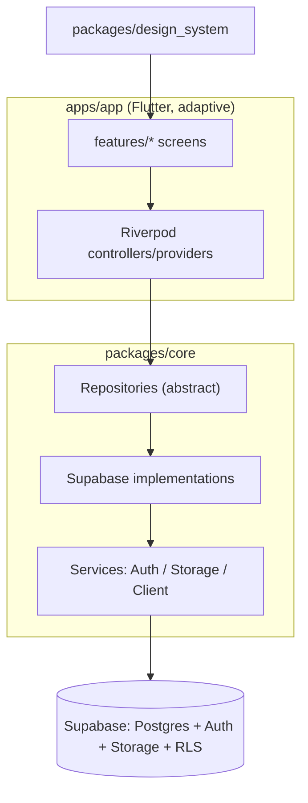
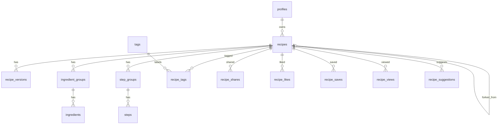

# SDS — Software Design Spec — Secret-Sauce

Authoritative design reference. Kept in sync with the code.

## 1. Overview

Secret-Sauce is a cross-platform recipe vault. Users create richly structured recipes, keep them
private or public, share privately with specific users, and **fork** others' recipes (git-style)
with a **version history** so recipes and their improvements are preserved across generations.

### Goals

- Make recipe **structure and instructions** clear and easy to follow.
- Preserve legacy recipes (attribution + story, immutable version snapshots).
- Enable sharing, discovery, and safe forking/improvement.

### Non-goals (now)

- Upstream "suggest changes" (PR-like) flow — schema hook reserved, UI deferred.
- Real-time collaborative editing.

## 2. Architecture

Single **adaptive** Flutter app; shared logic/UI in packages.

- UI → Riverpod → Repository (abstract) → Supabase impl → Supabase.
- UI never calls Supabase directly.
- Authorization is enforced by **RLS**; client checks are UX-only.

### Layers

| Layer         | Location                     | Responsibility                         |
| ------------- | ---------------------------- | -------------------------------------- |
| Presentation  | `apps/app/features/*`        | Screens, adaptive layout               |
| Design system | `packages/design_system`     | Theme, reusable widgets (`RecipeCard`) |
| State         | `apps/app` (Riverpod)        | Controllers, view-models               |
| Domain/Data   | `packages/core/repositories` | Contracts + Supabase impls             |
| Services      | `packages/core/services`     | Client bootstrap, auth, storage        |

## 3. Data model

### 3.1 Enums

- `difficulty`: `easy` \| `medium` \| `hard`
- `recipe_visibility`: `private` \| `public`
- `share_permission`: `view` (reserved: `edit`)
- `suggestion_status`: `open` \| `accepted` \| `rejected` (reserved for future PR flow)

### 3.2 Tables

**profiles** — 1:1 with `auth.users`
`id (uuid, PK, = auth.uid)`, `display_name`, `avatar_url`, `bio`, `created_at`.

**recipes**
`id`, `owner_id → profiles`, `title`, `description`, `cover_image_url`, `cuisine`,
`category`, `difficulty`, `prep_minutes`, `cook_minutes`, `servings`,
`visibility`, `attribution` (legacy: original creator/story),
`forked_from_recipe_id → recipes` (nullable), `forked_from_version_id → recipe_versions` (nullable),
`current_version_id → recipe_versions` (nullable), `like_count`, `save_count`, `view_count`,
`created_at`, `updated_at`.

**recipe_versions** — git-like immutable snapshots
`id`, `recipe_id → recipes`, `version_number (int)`, `parent_version_id → recipe_versions` (nullable),
`author_id → profiles`, `change_summary`, `content_snapshot (jsonb)` (full recipe body at that point),
`created_at`.

**ingredient_groups**: `id`, `recipe_id`, `name` (e.g. "For the sauce"), `sort_order`.
**ingredients**: `id`, `group_id → ingredient_groups`, `quantity (numeric, nullable)`,
`unit`, `name`, `note`, `is_optional (bool)`, `sort_order`.

**step_groups**: `id`, `recipe_id`, `name`, `sort_order`.
**steps**: `id`, `group_id → step_groups`, `step_order (int)`, `text`, `image_url`,
`duration_minutes`, `temperature`, `tip`, `sort_order`.

**tags**: `id`, `name (unique)`. **recipe_tags**: `recipe_id`, `tag_id` (PK pair).

**recipe_shares**: `recipe_id`, `shared_with_user_id → profiles`, `permission (share_permission)`,
`created_at` (PK: recipe_id + user).

**recipe_likes** / **recipe_saves**: `user_id`, `recipe_id`, `created_at` (PK pair).
**recipe_views**: `id`, `recipe_id`, `user_id (nullable)`, `viewed_at` (feeds trending).

**recipe_suggestions** _(reserved stub — not wired to UI)_
`id`, `recipe_id (target)`, `from_recipe_id (fork source)`, `author_id`, `status (suggestion_status)`,
`summary`, `payload (jsonb)`, `created_at`.

### 3.3 ERD

## 4. Row-Level Security

- **recipes SELECT**: `visibility = 'public'` OR `owner_id = auth.uid()` OR exists row in
  `recipe_shares` for `(recipe_id, auth.uid())`.
- **recipes INSERT/UPDATE/DELETE**: `owner_id = auth.uid()`.
- Child tables (ingredients/steps/versions/…): access derived from parent recipe visibility.
- **recipe_shares**: recipe owner manages; shared user can read own rows.
- **likes/saves**: user manages own rows; counts denormalized on `recipes` via triggers.
- **profiles**: readable by all; writable only by self.

## 5. Forking & versioning

- **Edit** → append a `recipe_versions` row (`version_number = max+1`, `parent_version_id` = prior),
  set `recipes.current_version_id`. Snapshots are immutable → full lineage retained.
- **Fork** → deep-copy recipe + its groups/ingredients/steps into a new recipe owned by the forker;
  set `forked_from_recipe_id` and `forked_from_version_id`. Independent thereafter.
- **Attribution** → `recipes.attribution` free-text preserves legacy origin/story; detail screen
  also shows "Forked from {title} by {owner}" when lineage exists.
- **Future PR flow** → `recipe_suggestions` reserved so a fork can later propose changes upstream.

## 6. Discovery & ranking

- **Access**: Discover, search, and public recipe detail are open to anonymous (signed-out)
  visitors — RLS `recipes SELECT` already permits reading `public` recipes without auth. Sign-in
  is only required for creating/editing, My Recipes, Profile, and owner actions (share, fork).
- **Recent**: `ORDER BY created_at DESC` over public recipes.
- **Popular**: all-time `save_count + like_count`.
- **Trending**: recency-weighted score, e.g.
  `score = (like_count + view_count) / pow(hours_since_created + 2, 1.5)`.
- **Search**: Postgres full-text over title + description + ingredient names + tags.

## 7. Screens

| Screen         | Route                             | Notes                                                                                 |
| -------------- | --------------------------------- | ------------------------------------------------------------------------------------- |
| Home / landing | `/`                               | Intro, feature highlights, sign in/up                                                 |
| Sign in / up   | `/auth`                           | Supabase auth                                                                         |
| Discover       | `/discover`                       | Popular / Trending / Recent tabs + search (public, no sign-in)                        |
| My Recipes     | `/my`                             | Tabs: My / Shared-with-me; `RecipeCard` grid                                          |
| Recipe detail  | `/recipe/:id`                     | Structured view, servings scaler, fork, versions (public recipes viewable signed-out) |
| Recipe editor  | `/recipe/new`, `/recipe/:id/edit` | Structured create/edit                                                                |
| Profile        | `/profile`                        | Current user                                                                          |

### Adaptive behavior

- Narrow (< 600): bottom navigation, single-column lists.
- Wide (≥ 1000): nav rail, multi-column grids, side-by-side detail.
- Breakpoints centralized in `design_system/layout/adaptive.dart`.

## 8. RecipeCard contract

Inputs: cover image, name, short description, cook time (prep+cook), difficulty badge.
Used across Discover and My Recipes.

## 9. Security notes

- No secrets in source; Supabase keys via `--dart-define` / env.
- All authorization via RLS; never rely on client filtering for privacy.
- Storage buckets scoped; signed/public URLs per bucket policy.
